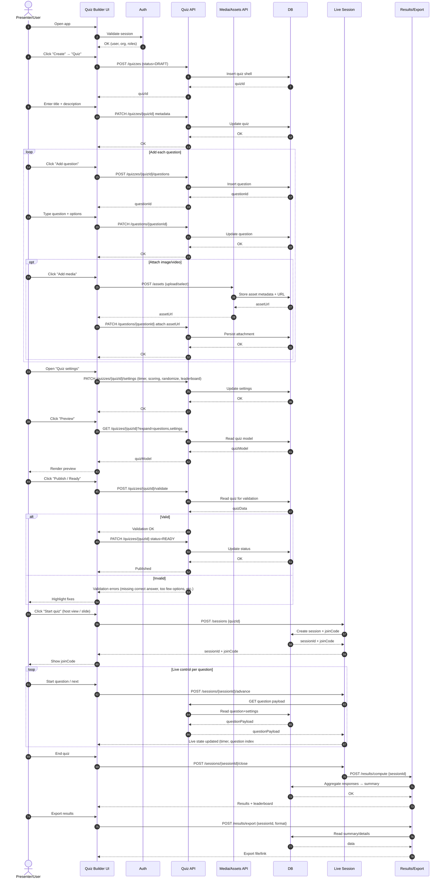
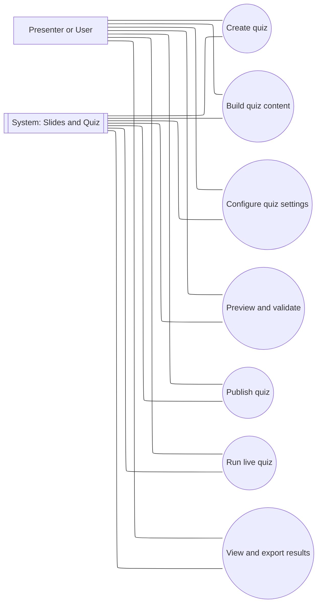
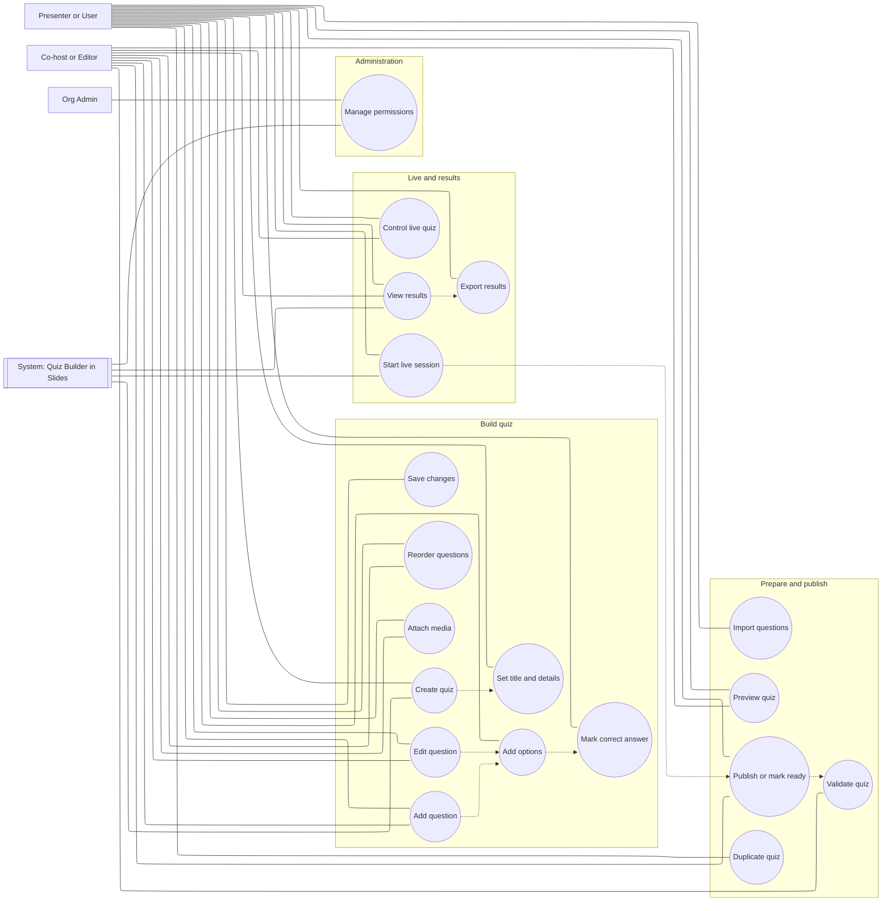
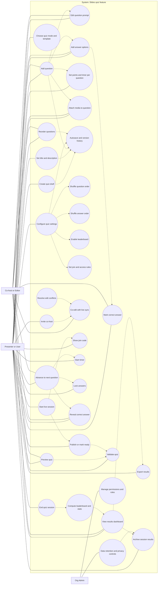

# Sequence diagram #

## Phase 1 — Macro view (big picture)

```mermaid
sequenceDiagram
  autonumber
  actor U as Presenter/User
  participant UI as Quiz Builder UI
  participant BE as Backend (APIs)
  participant DB as Database
  participant Live as Live Session Engine
  participant Res as Results/Export

  U->>UI: Start "New Quiz"
  UI->>BE: Create quiz draft
  BE->>DB: Save draft
  DB-->>BE: quizId
  BE-->>UI: quizId

  U->>UI: Build quiz (questions + settings)
  UI->>BE: Save changes (autosave)
  BE->>DB: Persist quiz content
  DB-->>BE: OK
  BE-->>UI: OK

  U->>UI: Preview & publish
  UI->>BE: Validate + publish
  BE->>DB: Update status READY
  DB-->>BE: OK
  BE-->>UI: Published

  U->>UI: Start live quiz
  UI->>Live: Create session + join code
  Live-->>UI: joinCode

  U->>UI: Run quiz live
  UI->>Live: Next question / timer / lock
  Live->>BE: Fetch question payload
  BE->>DB: Read question
  DB-->>BE: Question data
  BE-->>Live: Question data
  Live-->>UI: State updated

  U->>UI: End quiz + view results
  UI->>Res: Compute + show results
  Res->>DB: Read responses&#59; write summaries
  DB-->>Res: OK
  Res-->>UI: Results + exports
```

## Phase 2 - Phase 2 — First-level click-through (user journey steps)

## Phase 3 — Most detailed (first-time-reader friendly, includes autosave, collaboration, error paths) ##

```mermaid
sequenceDiagram
  autonumber
  actor U as Presenter/User
  actor C as Co-host/Editor (optional)
  participant UI as Quiz Builder UI
  participant Auth as Auth Service
  participant Perm as Permissions/Org Service
  participant Quiz as Quiz Service
  participant Media as Media Service
  participant Realtime as Realtime Sync (WS)
  participant DB as Database
  participant Live as Live Session Service
  participant Results as Results/Analytics
  participant Export as Export Service

  U->>UI: Open deck or workspace then Quiz
  UI->>Auth: Verify session token
  Auth-->>UI: Session OK with userId and orgId
  UI->>Perm: Check role for create and edit quizzes
  Perm-->>UI: Allowed

  U->>UI: Click New Quiz
  UI->>Quiz: Create draft quiz with status DRAFT
  Quiz->>DB: Insert quiz record and default settings
  DB-->>Quiz: quizId
  Quiz-->>UI: quizId and initial model

  UI->>Realtime: Connect WS channel for quizId
  Realtime-->>UI: Connected

  opt Co-host joins
    C->>UI: Open same quiz
    UI->>Auth: Verify session
    Auth-->>UI: Session OK for cohost
    UI->>Perm: Check role for edit
    Perm-->>UI: Allowed
    UI->>Realtime: Connect WS channel for quizId
    Realtime-->>UI: Connected
  end

  U->>UI: Type title and description
  UI-->>UI: Debounce changes
  UI->>Quiz: Patch metadata for quizId
  Quiz->>DB: Update quiz metadata
  DB-->>Quiz: OK
  Quiz-->>UI: OK
  UI->>Realtime: Broadcast metadata patch
  opt Co-host sees update
    Realtime-->>C: Metadata patch event
  end

  U->>UI: Click Add question and choose MCQ
  UI->>Quiz: Create question under quizId
  Quiz->>DB: Insert question shell
  DB-->>Quiz: questionId
  Quiz-->>UI: questionId
  UI->>Realtime: Broadcast question added
  opt Co-host sees new question
    Realtime-->>C: Question added event
  end

  U->>UI: Type prompt and options
  UI-->>UI: Client checks for non empty prompt and at least 2 options
  UI-->>UI: Show inline warnings if needed
  UI-->>UI: Debounce
  UI->>Quiz: Patch question content for questionId
  Quiz->>DB: Update question
  DB-->>Quiz: OK
  Quiz-->>UI: OK
  UI->>Realtime: Broadcast question patch
  opt Co-host sees edits live
    Realtime-->>C: Question patch event
  end

  U->>UI: Select correct option
  UI->>Quiz: Patch correctAnswer for questionId
  Quiz->>DB: Persist correctAnswer
  DB-->>Quiz: OK
  Quiz-->>UI: OK
  UI->>Realtime: Broadcast correctAnswer set
  opt Co-host sees correct answer set
    Realtime-->>C: Correct answer event
  end

  U->>UI: Click Add image
  UI->>Media: Upload asset
  Media->>DB: Store asset metadata
  DB-->>Media: assetId and assetUrl
  Media-->>UI: assetId and assetUrl
  UI->>Quiz: Attach assetId to questionId
  Quiz->>DB: Persist attachment
  DB-->>Quiz: OK
  Quiz-->>UI: OK
  UI->>Realtime: Broadcast media attached
  opt Upload fails
    Media-->>UI: Upload error
    UI-->>U: Show retry and allowed formats
  end

  U->>UI: Drag and drop reorder questions
  UI->>Quiz: Patch ordering for quizId
  Quiz->>DB: Persist ordering
  DB-->>Quiz: OK
  Quiz-->>UI: OK
  UI->>Realtime: Broadcast ordering update
  opt Co-host sees reorder
    Realtime-->>C: Ordering update event
  end

  U->>UI: Open settings
  UI-->>UI: Optimistic UI update
  UI->>Quiz: Patch settings for quizId
  Quiz->>DB: Persist settings
  DB-->>Quiz: OK
  Quiz-->>UI: OK
  UI->>Realtime: Broadcast settings update

  U->>UI: Click Preview
  UI->>Quiz: Get compiled quiz model for quizId
  Quiz->>DB: Read quiz questions and settings
  DB-->>Quiz: quizModel
  Quiz-->>UI: quizModel
  UI-->>U: Render preview

  U->>UI: Click Publish or Mark Ready
  UI->>Quiz: Validate quizId
  Quiz->>DB: Read full quiz
  DB-->>Quiz: quizData
  Quiz-->>UI: Validation result

  alt Validation OK
    UI->>Quiz: Patch status READY
    Quiz->>DB: Update status
    DB-->>Quiz: OK
    Quiz-->>UI: Ready
    UI->>Realtime: Broadcast status READY
  else Validation errors
    Quiz-->>UI: Errors like missing correct answer, empty prompt, not enough options
    UI-->>U: Highlight problems and link to fixes
  end

  U->>UI: Click Start quiz
  UI->>Live: Create session for quizId
  Live->>DB: Insert session in LOBBY state
  DB-->>Live: sessionId and joinCode
  Live-->>UI: sessionId and joinCode
  UI-->>U: Display joinCode

  loop For each question live
    U->>UI: Start question or Next
    UI->>Live: Advance session
    Live->>Quiz: Get question payload
    Quiz->>DB: Read question and settings
    DB-->>Quiz: payload
    Quiz-->>Live: payload
    Live->>DB: Update session state
    DB-->>Live: OK
    Live-->>UI: Broadcast live state
    opt Reveal answer
      U->>UI: Click Reveal
      UI->>Live: Reveal answer
      Live->>DB: Mark revealed
      DB-->>Live: OK
      Live-->>UI: Answer shown
    end
    opt Host reconnect
      UI->>Live: Get session snapshot
      Live-->>UI: State restored
    end
  end

  U->>UI: End quiz
  UI->>Live: Close session
  Live->>DB: Mark session CLOSED
  DB-->>Live: OK
  Live->>Results: Compute results
  Results->>DB: Aggregate responses and save summary
  DB-->>Results: OK
  Results-->>UI: Results ready

  U->>UI: Export results
  UI->>Export: Create export for sessionId
  Export->>DB: Read results
  DB-->>Export: data
  Export-->>UI: File link
  UI-->>U: Download export
```

# Use case diagram #

## Phase 1 — Macro use cases (big picture) ##

## Phase 2 — First level click-through (core use cases + relationships) ##

## Phase 3 — Most detailed (first-time reader, includes “extend” scenarios and guardrails) ##

