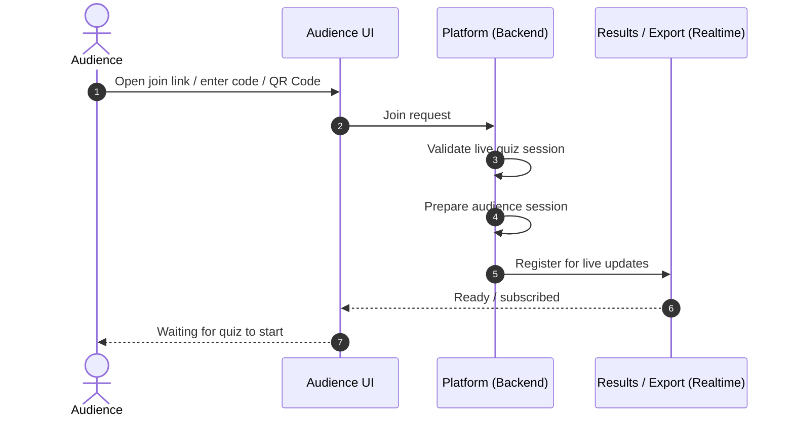
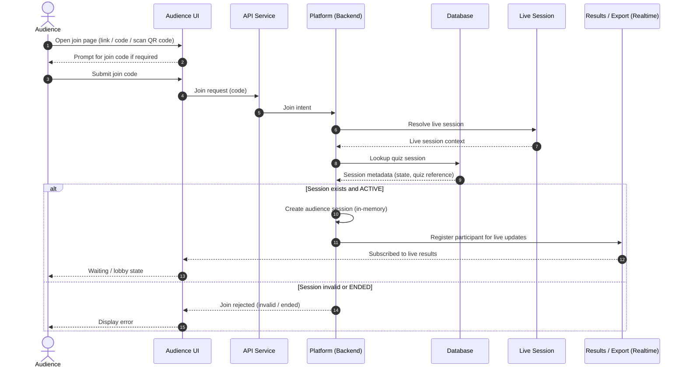
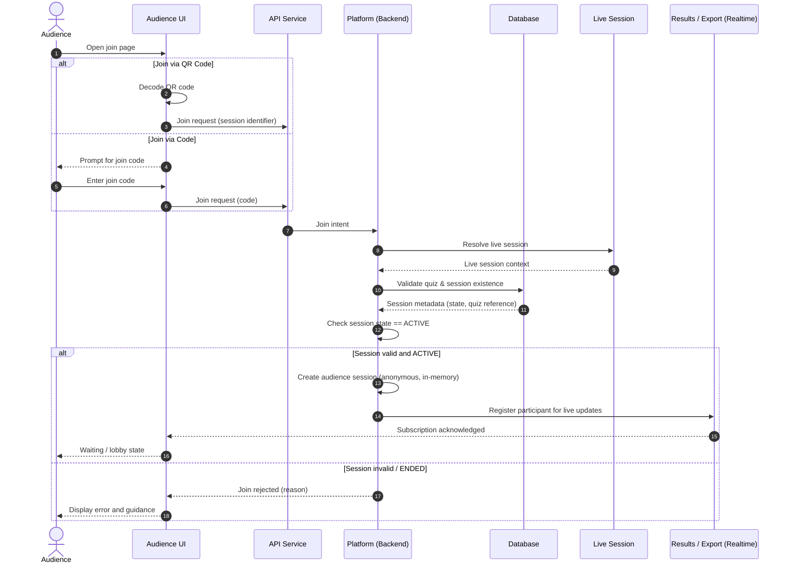

## Audience Participation – Join Quiz (MVP)

This diagram describes how an audience member joins an active quiz
using a code or link, without requiring authentication.

The flow focuses on validation, session binding, and readiness
for realtime participation.

## Phase 1 — Macro view (big picture)


## Phase 2 - First-level click-through 


## Phase 3 - Detailed view


---

## Interpretation of Actors (Codebase Perspective)

This section clarifies how the actors shown in the diagram map to
responsibilities and code locations within the repository.

Actors in this diagram represent **execution and responsibility boundaries**,
not concrete classes, APIs, or infrastructure components.

---

### Audience

**Audience** represents an external participant attempting to join
an active quiz session.

Important clarifications:
- Audience is **not** a code module
- Audience is **not** a tenant
- Audience is an external actor interacting with the platform

From a codebase perspective:
- Audience interactions enter the system via service entry points
- Audience actions are always resolved **within a tenant context**

Relevant areas:

```text
product-code/
├── services/
│   ├── api/          # Join request entry point
│   └── realtime/     # Live updates to audience
└── tenants/
    └── contexts/     # Audience bound to tenant + quiz session
```

Audience identity in MVP is:
- anonymous
- session-scoped
- non-persistent

---

### Platform

**Platform** represents the core runtime kernel responsible for
orchestrating quiz lifecycle and state.

Platform responsibilities in this flow:
- Validate quiz session existence
- Validate quiz session is active
- Create an audience session context
- Coordinate with the realtime layer
- Determine join success or rejection

Platform is intentionally:
- transport-agnostic
- tenant-agnostic at code level
- feature-orchestration focused

Relevant areas:

```text
product-code/
└── platform/
    ├── lifecycle/
    ├── configuration/
    ├── policies/
    └── extension-points/
```

The platform does **not** handle:
- HTTP or WebSocket specifics
- Connection management
- UI concerns

---

### Realtime

**Realtime** represents a dedicated execution boundary for
live message propagation.

It is separated from the platform to:
- isolate scaling behavior
- isolate cost characteristics
- reduce blast radius during failures

Realtime responsibilities in this flow:
- Register audience for live updates
- Broadcast questions and results
- Push updates to connected participants

Relevant areas:

```text
product-code/
├── services/
│   └── realtime/     # Connection and fan-out handling
└── libs/
    └── contracts/
        └── realtime/ # Message contracts and events
```

Realtime is:
- feature-agnostic
- tenant-scoped at runtime
- replaceable without changing platform logic

---

## How the Flow Traverses the Codebase

The diagram conceptually maps to the following execution flow:

1. Audience initiates join via service entry point
2. Platform resolves tenant and quiz session context
3. Platform validates session state
4. Platform creates an audience session context
5. Platform registers audience with realtime layer
6. Realtime pushes live updates to audience

In folder terms:

```text
Audience (external)
        ↓
services/api/
        ↓
platform/
        ↓
tenants/contexts/
        ↓
platform/
        ↓
services/realtime/
        ↓
Audience
```

This separation ensures:
- tenant isolation
- controlled blast radius
- independent scaling of realtime workloads

---

## Architectural Guardrails (MVP)

- Audience logic must not bypass tenant context resolution
- Platform must not manage realtime connections directly
- Realtime must not contain business or quiz logic
- Join flow must remain valid without authentication

These guardrails protect the system from early coupling and
support future evolution to multi-tenant and distributed deployments.

---
