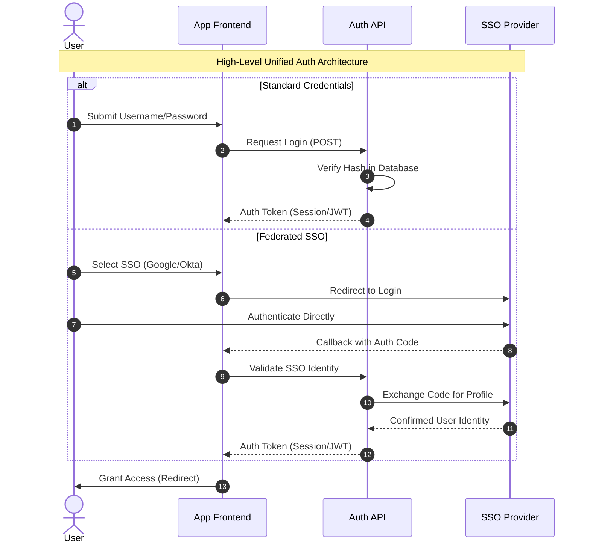

```mermaid
sequenceDiagram
    autonumber
    actor User
    participant Frontend as App Frontend
    participant Backend as Auth API
    participant IdP as SSO Provider

    Note over User, IdP: High-Level Unified Auth Architecture

    alt Standard Credentials
        User->>Frontend: Submit Username/Password
        Frontend->>Backend: Request Login (POST)
        Backend->>Backend: Verify Hash in Database
        Backend-->>Frontend: Auth Token (Session/JWT)
    else Federated SSO
        User->>Frontend: Select SSO (Google/Okta)
        Frontend->>IdP: Redirect to Login
        User->>IdP: Authenticate Directly
        IdP-->>Frontend: Callback with Auth Code
        Frontend->>Backend: Validate SSO Identity
        Backend->>IdP: Exchange Code for Profile
        IdP-->>Backend: Confirmed User Identity
        Backend-->>Frontend: Auth Token (Session/JWT)
    end

    Frontend->>User: Grant Access (Redirect)
```