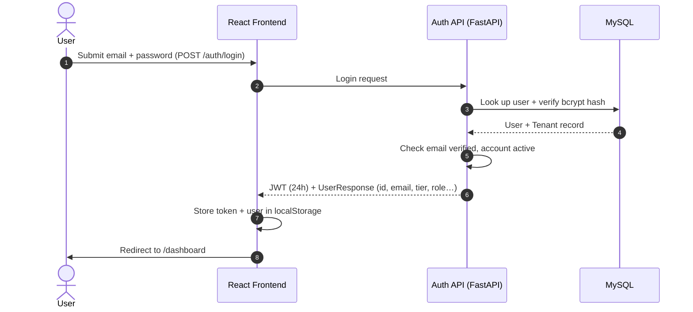

# Authentication — Swaya.me

## Overview

Swaya.me uses **JWT-based authentication** for host users. Audience participants join anonymously and do not authenticate. SSO is a future capability.

---

## Auth Flow



---

## Registration Flow

1. `POST /auth/register` — creates User + Tenant (Free tier by default)
2. Email verification token generated and sent via SMTP
3. Login blocked until `is_email_verified = true`
4. `POST /auth/verify-email` — marks user verified, sends welcome email

---

## Password Reset Flow

1. `POST /auth/forgot-password` — always returns 200 (prevents email enumeration); sends reset token if email exists
2. `POST /auth/reset-password` — validates token (1h expiry) and updates password hash

---

## JWT

- Library: `python-jose`
- Algorithm: configurable via `JWT_ALGORITHM` env var (default HS256)
- Expiry: `JWT_EXPIRATION_HOURS` (default 24h)
- Payload includes: `user_id`, `tenant_id`, `role`, `tier`

---

## Session Refresh

On every app load, the frontend calls `GET /auth/me` to refresh the stored user object from the live DB. This ensures changes to tier or role propagate without requiring a re-login.

```js
// App.jsx — fires on mount when authenticated
authAPI.getMe().then(r => dispatch(refreshUser(r.data)))
```

`get_me` re-fetches the Tenant from DB on every request (not from JWT cache), so tier changes reflect immediately after the frontend refreshes.

---

## Endpoints

| Method | Path | Auth | Description |
|--------|------|------|-------------|
| POST | `/auth/register` | None | Register new user + tenant |
| POST | `/auth/login` | None | Login, returns JWT + user |
| GET | `/auth/me` | Bearer | Return live user + tenant data |
| POST | `/auth/verify-email` | None | Verify email token |
| POST | `/auth/forgot-password` | None | Request reset email |
| POST | `/auth/reset-password` | None | Execute password reset |
| GET | `/auth/my-limits` | Bearer | Return current user's tier limits |
| GET | `/auth/tier-plans` | Bearer | Return all tiers' limits |

---

## Roles

| Role | Description |
|------|-------------|
| `super_admin` | Platform-level admin (tenant_id=1); manages orgs, tiers, all users |
| `admin` | Tenant-level admin; manages users within their org |
| `user` | Regular host; creates and runs quizzes |
| `viewer` | Read-only access |

---

## API Interceptors (Frontend)

`frontend/src/services/api.js` includes two Axios interceptors:

- **Request**: attaches `Authorization: Bearer {token}` from localStorage
- **Response**: on 401/403 with an auth token present → clears localStorage and redirects to `/login`; 403 without a token (participant session invalidation) is passed through to the component

---

## Audience Authentication

Audience participants do not authenticate. They receive a `session_token` (UUID) on joining via `POST /quizzes/sessions/join`. This token is used for all subsequent participant actions (submit answer, leave, feedback) and is stored in the browser for the session duration.

---

## Future: SSO / Federated Auth

SSO (Google/Okta/SAML) is planned but not yet implemented. The architecture supports it via the existing JWT issuance layer — the IdP callback would exchange an auth code for a user profile, then issue a Swaya.me JWT the same way as standard login.
