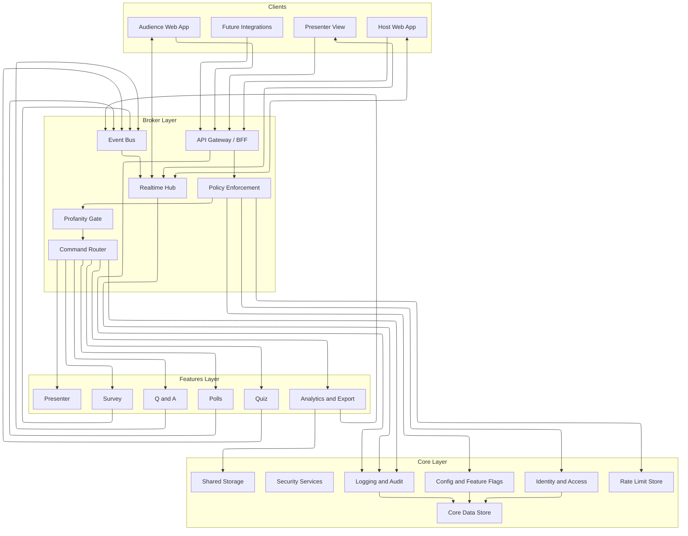

# swaya.me — Logical Architecture (High Level)

This document defines the **high-level logical architecture** for **swaya.me (Slido-like audience interaction platform)** using a **strict 3-layer model**:

1. **Core Layer** – foundational, cross-cutting platform capabilities  
2. **Broker Layer** – communication, policy enforcement, and orchestration  
3. **Features Layer** – independently deployable product capabilities (Q&A, Polls, Quiz, Word Cloud, etc.)

The architecture is intentionally designed to:
- Keep **Core stable and reusable**
- Centralize **policy enforcement** (auth, rate limits, profanity, security)
- Allow **Features to evolve independently** without coupling to platform concerns

---

## 1. Architectural Principles

- **Separation of Concerns**: Core never depends on Features; Features never talk directly to clients.
- **Single Ingress**: All client traffic flows through the Broker.
- **Policy First**: Security, rate limits, profanity, and moderation are enforced before business logic.
- **Realtime Safe by Design**: Nothing unapproved is ever broadcast.
- **Future-Proof**: Features can be deployed independently or split later without redesign.

---

## 2. Layer Overview

### Layer Summary

| Layer | Responsibility | Stability |
|------|---------------|-----------|
| Core | Platform foundation & governance | Very High |
| Broker | Routing, policies, realtime | High |
| Features | Product capabilities | Medium |

---

## 3. Core Layer (Platform Foundation)

**Purpose**  
Provide shared, cross-cutting capabilities used by every feature without duplication.

### Core Responsibilities

#### 3.1 Identity & Access Management
- Host authentication (email/password, OAuth)
- Audience session identity (anonymous or named)
- Role-based access control:
  - Host
  - Moderator
  - Audience
- Token issuance and verification

#### 3.2 Security Services
- Secure token handling
- Encryption in transit and at rest
- CSRF and XSS protection primitives
- Secure headers and request validation

#### 3.3 Configuration & Feature Flags
- Event-level policies:
  - Moderation on/off
  - Profanity handling mode
  - Rate limits
- Global feature toggles
- Progressive rollout support

#### 3.4 Logging, Auditing & Observability
- Structured application logs
- Metrics and traces
- **Audit logs** (mandatory for moderation and profanity actions)

#### 3.5 Data Persistence (Core Data)
- Users
- Events
- Roles and permissions
- Audience sessions
- Event configuration

#### 3.6 Shared Storage
- Exported analytics (CSV/JSON)
- Generated artifacts (word cloud images, etc.)

#### 3.7 Rate Limiting & Abuse Controls
- Per-event throttles
- Per-session throttles
- IP/device fingerprint support

---

## 4. Broker Layer (Communication & Orchestration)

**Purpose**  
Act as the **single entry point** and **traffic controller** between clients, core services, and feature components.

### Broker Responsibilities

#### 4.1 API Gateway / Backend-for-Frontend (BFF)
- Unified API surface for:
  - Host UI
  - Audience UI
  - Presenter mode
- Input validation
- API versioning
- Response shaping

#### 4.2 Policy Enforcement (MANDATORY)
All requests pass through policy checks before reaching features.

Policies include:
- Authentication & authorization
- Role validation
- Rate limiting
- Anti-spam rules
- **Profanity detection & enforcement**

**Profanity rules**
- Applied to *all* user-generated text:
  - Questions
  - Poll questions and options
  - Quiz questions and answers
  - Word cloud submissions
  - Open-text responses
  - Display names
- Enforcement happens **server-side only**
- Event-level modes:
  - Reject submission
  - Mask profanity
  - Route to moderation
- Profane content must never:
  - Reach a feature service
  - Be stored unsanitized
  - Be broadcast via realtime channels

#### 4.3 Realtime Hub
- WebSocket / SSE handling
- Event-scoped rooms
- Controlled broadcasting of approved content only
- Reconnect and resume support

#### 4.4 Command Routing & Orchestration
- Routes validated commands to the appropriate feature component
- Decouples client intent from feature implementation
- Enforces feature boundaries

#### 4.5 Event Bus / Messaging
- Publishes domain events (async)
- Enables:
  - Analytics aggregation
  - Audit logging
  - Notifications
- Prevents tight coupling between features

---

## 5. Features Layer (Product Capabilities)

**Purpose**  
Deliver end-user functionality as **modular, independently deployable components**.

### Design Rules for Features
- No direct client access
- No direct auth or policy logic
- No direct broadcasting
- Communicate only through the Broker
- Own only their domain logic

### Feature Components

#### 5.1 Q&A Feature
- Submit questions
- Upvote
- Sort (new, trending)
- Highlight and mark answered
- Moderation queue support

#### 5.2 Polls Feature
- Multiple Choice (single/multi select)
- Rating polls
- Ranking polls
- Open text polls
- Word cloud generation

#### 5.3 Quiz Feature
- Timed questions
- Correct answers
- Scoring
- Leaderboard support

#### 5.4 Survey Feature (V1)
- Multi-question flows
- Optional branching

#### 5.5 Presenter Mode
- Optimized read-only views
- Large typography
- High-contrast layouts
- Embed/projector support

#### 5.6 Analytics & Exports
- Aggregates domain events
- Engagement metrics
- CSV/JSON export generation

---

## 6. Logical Architecture Diagram

## 7. Text Input Flow (Policy-First)

1. Client submits text input
2. Broker API Gateway receives request
3. Policy Enforcement:
   - AuthZ
   - Rate limits
   - Profanity detection
4. Based on event policy:
   - Reject OR
   - Mask OR
   - Send to moderation
5. Only sanitized/approved content:
   - Reaches feature service
   - Is stored
   - Is broadcast via realtime hub

---

## 8. Scalability & Evolution

- Core scales conservatively and changes slowly
- Broker scales horizontally and handles spikes
- Features scale independently (polls and word cloud may spike writes)
- Messaging layer enables async growth without coupling

---

## 9. Implementation Guidance

For MVP:
- Implement Core + Broker as modular services in one backend
- Implement Features as isolated modules
- Keep contracts (APIs/events) stable

For V1+:
- Extract features into independent services
- Introduce shared pub/sub for realtime scaling
- Add external integrations (Slides, Zoom, Teams)

---

## 10. Summary

This 3-layer architecture ensures:
- Strong governance and safety guarantees
- Clean feature evolution
- Zero profanity leakage
- Slido-like scalability and UX
- Long-term maintainability

This structure is intentionally aligned with enterprise-grade real-time interaction platforms.
