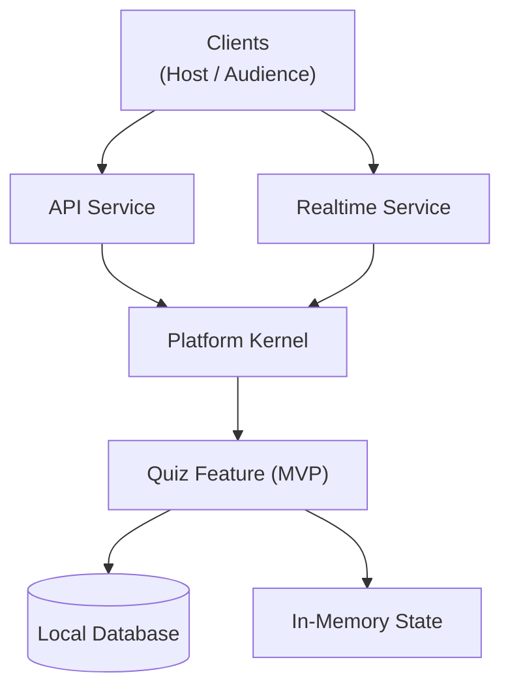
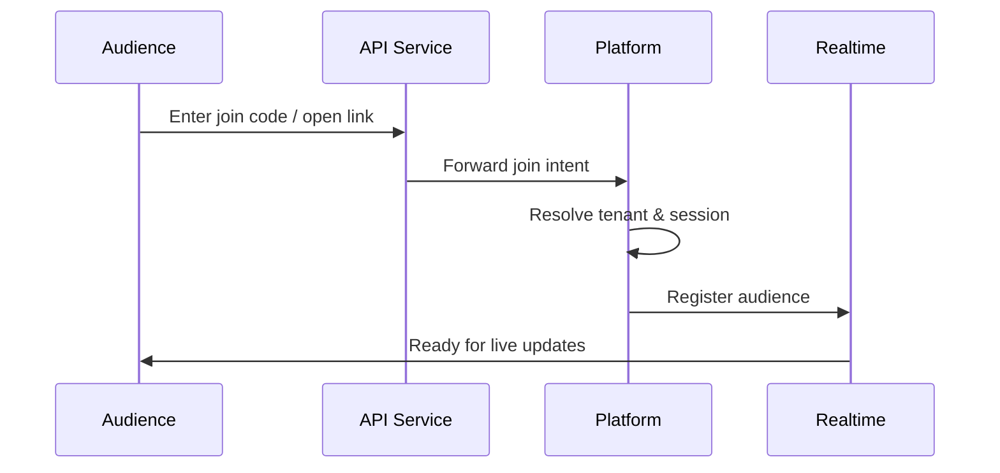

# MVP High-Level Architecture

This document describes the high-level architecture of the
Interactive Audience Engagement Platform for the MVP phase.

The architecture is designed to:
- run on a single cloud-hosted Linux VM (OCI IaaS)
- avoid vendor lock-in
- support fast MVP development
- scale incrementally without architectural rewrite

This document focuses on **structure and responsibilities**, not
frameworks, protocols, or cloud-native services.

---

## Architectural Style

### Modular Monolith

The MVP follows a **modular monolith** architecture:

- Single deployable unit
- Explicit internal boundaries
- Clear separation of responsibilities

Deployment is monolithic.  
Architecture is modular.

This approach balances:
- speed of development
- operational simplicity
- future scalability

---

## High-Level Logical View

---

## Execution Boundaries
### Client Layer
- Browser-based hosts and audience participants
- Audience participation is anonymous and session-scoped

---
### Services Layer

Services act as entry points into the system.

They are responsible for:

- handling external communication
- translating transport interactions into platform intent

They do not contain business logic.

#### API Service

- Handles request/response interactions

- Examples:
    - create quiz
    - start quiz
    - join quiz
    - submit answer

#### Realtime Service

- Manages live connections
- Responsible for message fan-out
- Handles real-time delivery of:
    - questions
    - answer updates
    - results

---
## Platform Kernel

The platform kernel is the orchestration core of the system.

Responsibilities:
- quiz session lifecycle management
- feature orchestration
- tenant context resolution
- policy enforcement

The platform:
- is transport-agnostic
- does not manage connections
- does not contain feature logic

---

## Feature Layer (MVP)

### Quiz Feature

The Quiz feature is the primary business capability in the MVP.

Responsibilities:
- quiz definition
- question sequencing
- answer evaluation
- result aggregation

Rules:
- features are invoked by the platform
- features do not communicate directly with services
- features do not resolve tenant context

---

## Tenant Context

Tenant context provides runtime isolation.

Responsibilities:

- tenant identification
- configuration scoping
- isolation boundaries

In the MVP:

- a single-tenant model is used
- the structure supports future multi-tenant expansion

Tenant context is resolved once per request and propagated internally.

---

## Persistence & Runtime State

The MVP uses:

- a local database running on the same Linux VM
- in-memory state for live quiz sessions

Persistence is abstracted so that:

- database technology can change
- platform and feature logic remain unaffected

---

## Join Quiz – Execution Flow (Reference)

---

## Deployment Model (MVP)

The MVP runs on:

- a single OCI IaaS Linux VM
- no managed cloud services
- no vendor-specific dependencies

All components run within a single application process:

- API service
- Realtime service
- Platform kernel
- Quiz feature

This minimizes:

- operational complexity
- cost
- latency

---

## Scalability Path

The architecture supports incremental scaling without redesign.

### Phase 1 – MVP

- Single VM
- Single process
- In-memory session state

### Phase 2 – Growth

- Multiple VMs
- Stateless API services
- Shared database

### Phase 3 – Expansion

- Realtime service separation
- Feature-level scaling
- Tenant-level isolation

---

## Architectural Guardrails

The following rules must be upheld:

- Services do not contain business logic
- Platform does not manage transport concerns
- Features do not resolve tenant context
- Realtime does not contain feature logic
- Persistence is replaceable

Violating these rules introduces coupling and should be avoided.

---

## Non-Goals (MVP)

The MVP explicitly excludes:
- microservices
- container orchestration
- managed cloud services
- message brokers
- AI in core execution paths

These may be introduced later if justified.