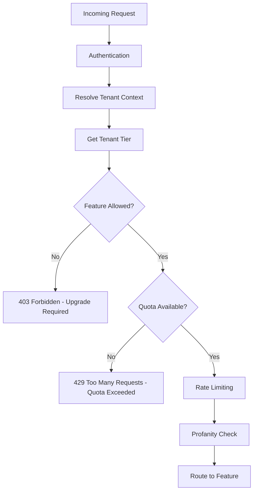

# Pricing Tiers & Feature Entitlements

## Overview

Swaya.me implements a **multi-tenant SaaS** pricing model with configurable tier-based feature gates and usage limits, similar to Slido's approach. This document defines the tier structure, entitlement system, and architectural integration.

---

## Tier Structure (Slido-Inspired)

| Tier | Target Audience | Monthly Price | Typical Use Case |
|------|----------------|---------------|------------------|
| **Free** | Individual educators, small teams | $0 | Classroom quizzes, team meetings |
| **Basic** | Growing teams, regular users | $10-15/user/month | Weekly team standups, workshops |
| **Pro** | Professional users, frequent events | $25-40/user/month | Client presentations, training sessions |
| **Enterprise** | Large organizations, custom needs | Custom pricing | Company-wide deployment, integration needs |

---

## Feature Entitlements Matrix

| Feature Category | Free | Basic | Pro | Enterprise |
|-----------------|------|-------|-----|------------|
| **Participants per Event** | 50 | 100 | 1,000 | Unlimited |
| **Questions per Quiz** | 10 | 25 | 100 | Unlimited |
| **Active Events (concurrent)** | 1 | 3 | 10 | Unlimited |
| **Event History (days)** | 7 | 30 | 365 | Unlimited |
| **Quiz Types** | MCQ only | MCQ + Polls | All types | All types + Custom |
| **Word Cloud** | ❌ | ✅ | ✅ | ✅ |
| **Live Results** | Basic counts | Percentages | Charts + Export | Real-time analytics |
| **Branding Removal** | ❌ | ❌ | ✅ | ✅ |
| **Custom Branding** | ❌ | ❌ | ✅ | ✅ |
| **Export Data (CSV/JSON)** | ❌ | ✅ | ✅ | ✅ + API access |
| **Profanity Filtering** | Auto-reject | Configurable | Configurable | Configurable + Custom |
| **Moderation Queue** | ❌ | ❌ | ✅ | ✅ |
| **Team Collaboration** | 1 user | 3 users | 10 users | Unlimited |
| **Priority Support** | ❌ | Email | Email + Chat | Dedicated account manager |
| **API Access** | ❌ | ❌ | Read-only | Full access |
| **SSO/SAML** | ❌ | ❌ | ❌ | ✅ |
| **Webhook Notifications** | ❌ | ❌ | ✅ | ✅ |
| **Audience Analytics** | Basic | Standard | Advanced | Custom dashboards |

---

## Usage Limits & Quotas

### Quota Types

| Quota Type | Scope | Enforcement Point | Reset Frequency |
|-----------|-------|-------------------|-----------------|
| **Participant limit** | Per event | Join request (Broker) | Per event |
| **Question limit** | Per quiz | Quiz creation (Platform) | Per quiz |
| **Active events** | Per tenant | Event start (Platform) | Rolling count |
| **Storage limit** | Per tenant | Data persistence (Core) | Monthly reset |
| **API calls** | Per tenant | API Gateway (Broker) | Per hour |
| **Export frequency** | Per tenant | Export request (Feature) | Daily |

### Configurable Limits Schema

```json
{
  "tier_id": "pro",
  "limits": {
    "max_participants_per_event": 1000,
    "max_questions_per_quiz": 100,
    "max_concurrent_events": 10,
    "max_team_members": 10,
    "event_history_days": 365,
    "storage_mb": 5000,
    "api_calls_per_hour": 10000,
    "exports_per_day": 50
  },
  "features": {
    "quiz_types": ["mcq", "poll", "word_cloud", "survey"],
    "custom_branding": true,
    "branding_removal": true,
    "moderation_queue": true,
    "data_export": true,
    "api_access": "readonly",
    "sso_enabled": false,
    "webhook_enabled": true,
    "profanity_mode": "configurable"
  }
}
```

---

## Architectural Integration

### Core Layer Extensions

#### 3.8 Subscription & Tier Management (NEW)

**Responsibilities:**
- Tenant subscription state tracking
- Tier entitlement resolution
- Usage quota tracking and enforcement
- Billing period management
- Feature flag resolution per tenant

**Data Model:**

```python
# Tenant represents an organization/account
Tenant:
  - tenant_id: UUID
  - name: str
  - subscription_tier: str (free|basic|pro|enterprise)
  - subscription_status: str (active|trial|suspended|cancelled)
  - subscription_start: datetime
  - subscription_end: datetime (nullable)
  - billing_cycle: str (monthly|annual|custom)

# TierConfig defines limits and features per tier
TierConfig:
  - tier_id: str (free|basic|pro|enterprise)
  - limits: JSON (quota definitions)
  - features: JSON (feature gates)
  - is_active: bool
  - effective_from: datetime

# UsageQuota tracks consumption against limits
UsageQuota:
  - tenant_id: UUID
  - quota_type: str (participants|events|api_calls|storage)
  - period_start: datetime
  - period_end: datetime
  - limit: int
  - consumed: int
  - last_updated: datetime
```

#### 3.9 Entitlement Service (NEW)

**API:**

```python
def check_feature_access(tenant_id: UUID, feature: str) -> bool:
    """Returns True if tenant's tier includes the feature"""
    
def check_quota_available(tenant_id: UUID, quota_type: str, amount: int) -> bool:
    """Returns True if tenant has quota available"""
    
def consume_quota(tenant_id: UUID, quota_type: str, amount: int) -> None:
    """Increments quota consumption"""
    
def get_tenant_limits(tenant_id: UUID) -> dict:
    """Returns all limits for tenant's current tier"""
```

---

## Policy Enforcement Flow

### Broker Layer Integration

**Extended Policy Checks (Section 4.2):**



**Example Enforcement Points:**

| Action | Tier Check | Quota Check | Fallback Behavior |
|--------|-----------|-------------|-------------------|
| Join Event | Check max_participants | Consume participant slot | Show "Event Full" + Upgrade CTA |
| Create Question | Check max_questions | Increment question count | Block creation + Upgrade CTA |
| Start Event | Check concurrent_events | Increment active count | Prevent start + Upgrade CTA |
| Export Data | Check data_export feature | Consume export quota | Show "Upgrade to Export" |
| Custom Branding | Check custom_branding feature | N/A | Show default branding |
| API Call | Check api_access feature | Consume API quota | 403 Forbidden |

---

## Tenant Context Resolution

### Flow (Executed Once Per Request)

1. **Extract tenant identifier** from:
   - JWT claim (for authenticated hosts)
   - Session token (for audience via join code)
   - API key (for API access)

2. **Load tenant context:**
   - Subscription tier
   - Feature entitlements
   - Current quota consumption

3. **Propagate context** to Platform and Features

4. **Cache** tenant context (Redis, 5-minute TTL)

### Implementation Pattern

```python
# Middleware in API Service
async def tenant_context_middleware(request: Request, call_next):
    tenant_id = extract_tenant_from_request(request)
    
    # Load and cache
    tenant_context = await load_tenant_context(tenant_id)
    
    # Attach to request
    request.state.tenant = tenant_context
    
    response = await call_next(request)
    return response

# Usage in Broker Policy Enforcement
def enforce_tier_policy(tenant: TenantContext, action: str):
    if not tenant.has_feature(action):
        raise TierRestrictionError(
            message=f"Feature '{action}' requires upgrade",
            current_tier=tenant.tier,
            required_tier="pro"
        )
    
    if not tenant.has_quota(action):
        raise QuotaExceededError(
            message=f"Quota exceeded for '{action}'",
            limit=tenant.limits[action],
            consumed=tenant.quotas[action]
        )
```

---

## MVP Implementation Priorities

### Phase 1: Foundation (MVP)
- [x] Tenant data model
- [x] Tier configuration storage
- [x] Basic entitlement service
- [x] Tenant context resolution
- [x] Hardcoded tier configs (Free + Pro only)

### Phase 2: Enforcement (MVP+1)
- [ ] Participant limit enforcement
- [ ] Question limit enforcement
- [ ] Concurrent event limit
- [ ] Feature gates in UI (show/hide based on tier)

### Phase 3: Monetization (Post-MVP)
- [ ] Admin UI for tier management
- [ ] Usage dashboards
- [ ] Billing integration (Stripe/Paddle)
- [ ] Upgrade flows
- [ ] Trial period management

### Phase 4: Enterprise (V2)
- [ ] Custom tier definitions
- [ ] Per-tenant limit overrides
- [ ] SSO integration
- [ ] White-label branding
- [ ] Dedicated infrastructure options

---

## Configuration Management

### Tier Configuration Source

**MVP Approach:**
- Tier definitions stored in database (TierConfig table)
- Loaded at startup, cached in memory
- Updated via admin API (post-MVP) or database migration

**Example Configuration File (seed data):**

```yaml
tiers:
  - id: free
    name: Free
    limits:
      max_participants_per_event: 50
      max_questions_per_quiz: 10
      max_concurrent_events: 1
      event_history_days: 7
    features:
      quiz_types: [mcq]
      custom_branding: false
      data_export: false

  - id: pro
    name: Professional
    limits:
      max_participants_per_event: 1000
      max_questions_per_quiz: 100
      max_concurrent_events: 10
      event_history_days: 365
    features:
      quiz_types: [mcq, poll, word_cloud, survey]
      custom_branding: true
      data_export: true
      api_access: readonly
```

---

## Error Responses

### Tier Restriction Error

```json
{
  "error": "tier_restriction",
  "message": "This feature requires a Professional plan",
  "details": {
    "feature": "custom_branding",
    "current_tier": "free",
    "required_tier": "pro",
    "upgrade_url": "/upgrade"
  }
}
```

### Quota Exceeded Error

```json
{
  "error": "quota_exceeded",
  "message": "Participant limit reached for this event",
  "details": {
    "quota_type": "participants_per_event",
    "limit": 50,
    "consumed": 50,
    "reset_at": "2026-01-30T15:00:00Z",
    "upgrade_url": "/upgrade"
  }
}
```

---

## Testing Strategy

### Unit Tests (Feature Layer)
- Quota calculation logic
- Entitlement resolution
- Limit validation

### Integration Tests (Platform Layer)
- Tenant context propagation
- Policy enforcement accuracy
- Multi-tenant data isolation

### E2E Tests
- Upgrade flow (Free → Pro)
- Quota exhaustion scenarios
- Feature gate UI visibility
- Graceful degradation

---

## Migration Considerations

### From Single-Tenant to Multi-Tenant

1. **Add tenant_id to all domain tables**
2. **Create default tenant for existing data**
3. **Update all queries to scope by tenant_id**
4. **Add tenant context middleware**
5. **Implement quota tracking**
6. **Add tier-based feature gates**

### Data Isolation Strategy

- **Row-level filtering:** Every query includes `WHERE tenant_id = ?`
- **Database views:** Create tenant-scoped views for safety
- **ORM support:** SQLAlchemy filters automatically apply tenant_id
- **Audit logging:** All actions logged with tenant context

---

## Monitoring & Observability

### Key Metrics

| Metric | Purpose | Alert Threshold |
|--------|---------|-----------------|
| Quota utilization per tenant | Identify upgrade candidates | >80% of limit |
| Tier restriction errors | Feature discoverability | >10% of requests |
| Quota exceeded errors | Capacity planning | >5% of requests |
| Tier distribution | Revenue planning | N/A |
| Upgrade conversion rate | Product optimization | <2% |

### Audit Requirements

- Log all quota consumption events
- Log all tier restriction denials
- Log all tier upgrades/downgrades
- Log all manual limit overrides (Enterprise)

---

## Summary

This tier system integrates into your 3-layer architecture as follows:

- **Core Layer:** Owns subscription state, tier config, entitlement logic
- **Broker Layer:** Enforces tier policies before routing to features
- **Features Layer:** Remain tier-agnostic; limits enforced externally

All tier configurations are **database-driven and configurable**, allowing dynamic tier updates without code changes.
