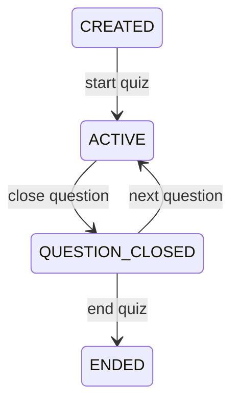

# Quiz Feature – Internal Design (MVP)

This document defines the **internal design** of the Quiz feature for the MVP.
It focuses on **state, lifecycle, and rules**, independent of transport,
storage technology, or UI.

The Quiz feature is invoked and orchestrated by the **Platform Kernel**.
It does not interact directly with services, realtime connections, or tenants.

---

## Feature Scope (MVP)

The Quiz feature is responsible for:
- representing quiz definitions
- managing live quiz session state
- validating and recording answers
- aggregating results per question

The feature is **single-session focused** and optimized for live play.

---

## Core Concepts

| Title | Description | Includes | Characteristics | Non-Responsibilities |
|------|-------------|----------|-----------------|----------------------|
| Quiz Definition | A reusable description of a quiz that defines questions and correct answers independent of live play. | Quiz ID, list of questions, options per question, correct answer | Immutable during live sessions, reusable across sessions, versionless in MVP | Does not track live state, answers, participants, or results |
| Question | A single prompt presented to the audience during a quiz session. | Question text, answer options, correct option | Belongs to one quiz definition, activated sequentially, only one active at a time | Does not manage timing, submissions, or scoring |
| Quiz Session | A live runtime instance of a quiz being played. | Session ID, quiz reference, current question index, session state | Ephemeral, stateful, exists only during live play | Does not define quiz content or persist after end |
| Participant | A session-scoped representation of an audience member. | Participant ID, session reference | Anonymous, temporary, bound to a single session | Does not have identity, profile, or cross-session memory |

## Quiz Session State Model

| State | Description | Allowed Actions | Entry Conditions | Exit Conditions | Invariants |
|------|-------------|-----------------|------------------|-----------------|------------|
| CREATED | Quiz session is created but not yet started. No audience interaction is allowed. | Start quiz | Valid quiz definition exists and session is initialized | Host starts the quiz | No active question, no answers accepted |
| ACTIVE | A question is currently open for audience participation. | Accept answers, close question | Session started OR next question activated | Host closes current question | Exactly one active question, answers allowed |
| QUESTION_CLOSED | Current question is closed. Answers are no longer accepted and results can be evaluated. | Reveal correct answer, view results, move to next question, end quiz | Host closes question | Host moves to next question OR ends quiz | No answers accepted, results are stable |
| ENDED | Quiz session is completed and no further actions are permitted. | View final results | Host ends quiz | None (terminal state) | No state changes allowed |

### State Transitions

State transitions are explicit and platform-driven.

## Question Lifecycle (MVP)

| Stage | Description | Allowed Actions | Entry Conditions | Exit Conditions | Invariants |
|------|-------------|-----------------|------------------|-----------------|------------|
| INACTIVE | Question exists in the quiz definition but is not yet part of live play. | None | Quiz session created OR previous question active | Platform activates this question | Question not visible to audience, no answers accepted |
| OPEN | Question is currently active and visible to the audience. | Accept answer submissions | Platform transitions session to ACTIVE state | Host closes the question | Exactly one question open at a time, answers accepted |
| CLOSED | Question is no longer accepting answers; results can be evaluated. | Aggregate results, reveal correct answer | Host closes the question | Platform moves to next question OR ends quiz | No answer mutations allowed |

## Answer Submission Rules (MVP)

| Rule Area | Description | Validation Condition | Outcome on Violation | Notes |
|----------|-------------|----------------------|----------------------|-------|
| Submission Timing | Answers can be submitted only while a question is open. | Question state must be OPEN | Reject submission | No buffering or retry in MVP |
| Submission Count | Each participant may submit only one answer per question. | No prior submission exists for participant-question pair | Reject submission | Prevents overwriting answers |
| Participant Scope | Submission must belong to the current quiz session. | Participant bound to session | Reject submission | Enforced via session context |
| Answer Mutability | Submitted answers cannot be changed. | Submission already recorded | Reject modification | Simplifies state handling |
| Late Submissions | Submissions after question closure are invalid. | Question state is CLOSED | Reject submission | Ensures deterministic results |

## Result Aggregation (MVP)

| Aspect | Description | Input | Output | Constraints | Notes |
|------|-------------|-------|--------|-------------|-------|
| Aggregation Trigger | Aggregation occurs when a question is closed. | Answer submissions for a question | Aggregated counts per option | Triggered only once per question | Platform-controlled |
| Aggregation Method | Count-based aggregation per answer option. | List of submissions | Option → count map | Deterministic, order-independent | No weighting |
| Correct Answer Evaluation | Correct option is identified post-closure. | Correct option + submissions | Correct vs incorrect counts | Evaluated only after closure | No scoring |
| Recalculation | Aggregates can be recomputed from submissions. | Stored submissions | Same aggregate result | Must be idempotent | Supports recovery |
| Result Scope | Results are question-scoped. | Single question data | Question-level result | No cross-question aggregation | No leaderboard |

## Interaction with Platform Kernel (MVP)

| Interaction Point | Initiator | Feature Responsibility | Platform Responsibility | Constraints |
|------------------|----------|------------------------|--------------------------|-------------|
| Session Creation | Platform | Initialize quiz session state | Decide when session is created | Feature does not create sessions |
| State Transition | Platform | Validate and apply state change | Invoke valid transitions only | Invalid transitions rejected |
| Question Progression | Platform | Move to next question state | Control progression timing | Feature enforces rules |
| Answer Submission | Platform | Validate and record answer | Forward submission intent | Feature owns validation |
| Result Request | Platform | Provide aggregated results | Decide when to request | Read-only access |

## Testability Expectations (MVP)

| Area | Expectation | Test Type | Scope | Notes |
|----|-------------|-----------|-------|-------|
| State Transitions | All valid/invalid transitions must be testable. | Unit tests | Feature only | No platform dependency |
| Answer Validation | Submission rules must be deterministic. | Unit tests | Feature only | No realtime required |
| Aggregation Logic | Aggregates must be correct and repeatable. | Unit tests | Feature only | Idempotent checks |
| Isolation | Feature must run without services or DB. | In-memory tests | Feature only | Required for fast tests |
| Determinism | Same input must produce same output. | Property tests (optional) | Feature only | No randomness |

## Non-Goals (MVP)

| Area | Explicitly Excluded | Reason |
|----|---------------------|--------|
| Scoring | Points, rankings, leaderboards | Not required for engagement MVP |
| Timing | Timers, countdowns, auto-close | Adds complexity |
| Analytics | Cross-session or historical analysis | Post-MVP concern |
| AI | AI-based evaluation or adaptation | Cost and dependency risk |
| Persistence | Long-term storage guarantees | MVP focuses on live play |

## Design Guardrails (MVP)

| Guardrail | Description | Violation Impact |
|----------|-------------|------------------|
| No Hidden State | All session state must be explicit. | Debugging complexity |
| No Side Effects | Feature must not trigger external actions. | Tight coupling |
| No Platform Assumptions | Feature must not assume transport or deployment. | Reduced portability |
| No Realtime Logic | Feature does not broadcast messages. | Scaling issues |
| No Tenant Logic | Feature does not resolve tenant context. | Isolation breakage |

