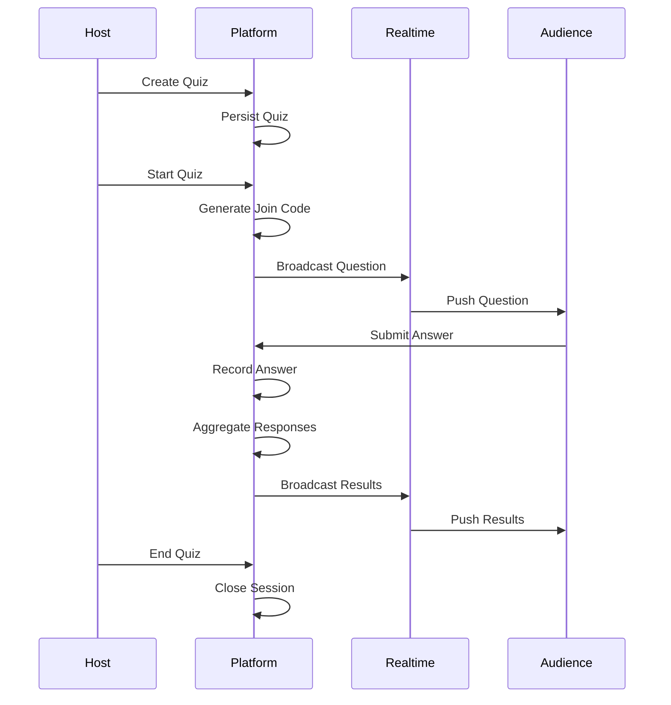
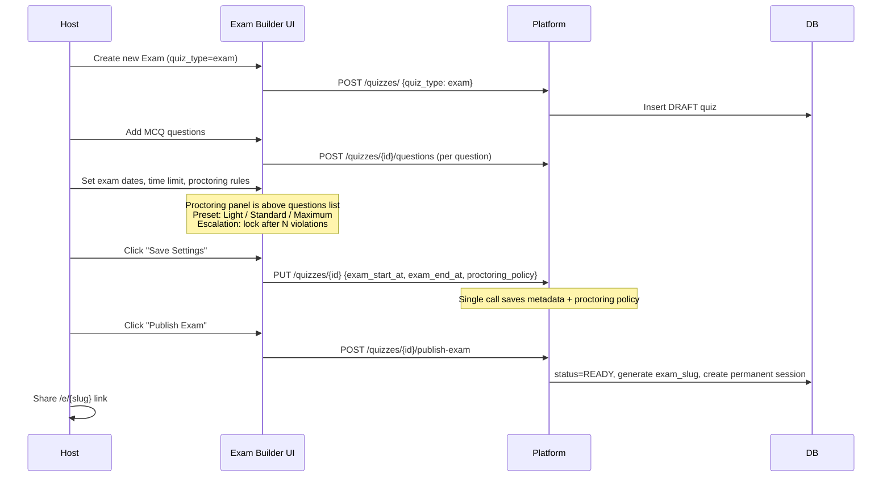
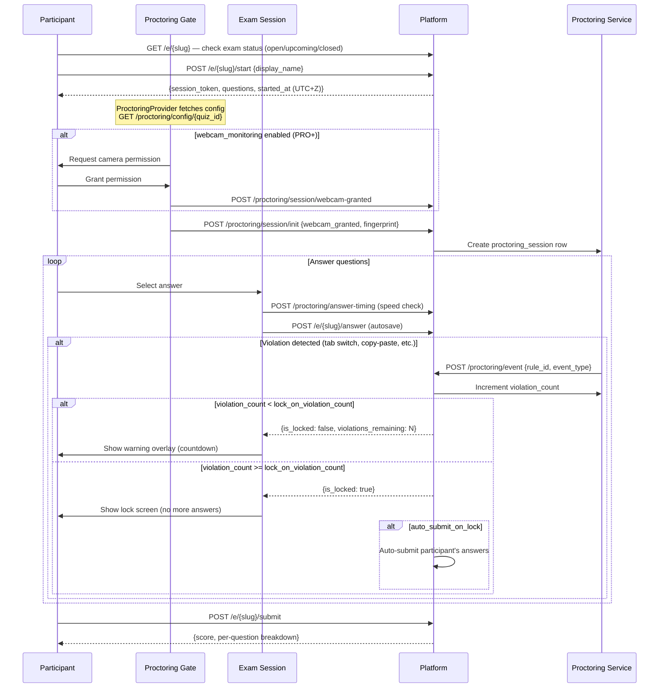
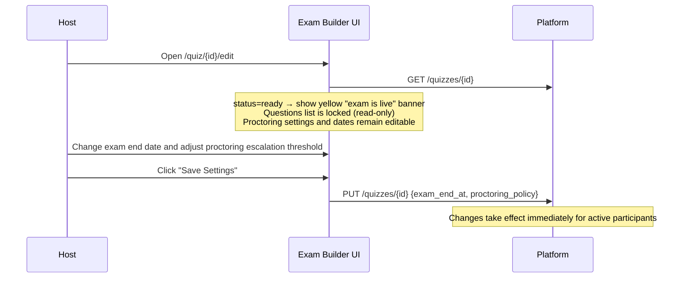

# Quiz User Journey (MVP)

This document represents the end-to-end user journey for the
Quiz MVP using a lightweight, sequence-style swimlane format.

The intent is to clearly show:
- actor responsibilities
- interaction order
- realtime involvement

This representation is intentionally technology-agnostic.

---

## Actors

- Host: Creates and controls the quiz
- Platform: Orchestrates quiz lifecycle and state
- Realtime: Propagates live updates
- Audience: Joins and participates in the quiz

---

## Quiz Creation & Live Play Flow

---

## Key Observations

- The **Host** controls quiz lifecycle (create, start, end)
- The **Platform** owns:
  - session state
  - answer aggregation
  - tenant resolution
- The **Realtime** layer is used only for:
  - broadcasting questions
  - pushing live updates
- The **Audience**:
  - joins anonymously
  - participates in real time
  - does not control flow

---

## Design Constraints (MVP)

- Happy path only
- No retry or reconnection logic
- No offline support
- No AI dependency
- Realtime failures should degrade gracefully

---

## Usage of This Document

- Input to high-level architecture design
- Reference for feature implementation
- Alignment artefact for contributors

This document will evolve incrementally as the platform grows.

---

## Exam Creation & Proctoring Flow (Host)

---

## Exam Participation Flow (with Proctoring)

---

## Live Exam Edit Flow (Host — Exam Already Published)

