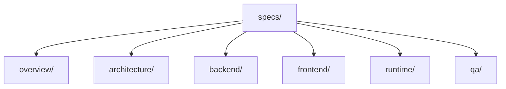
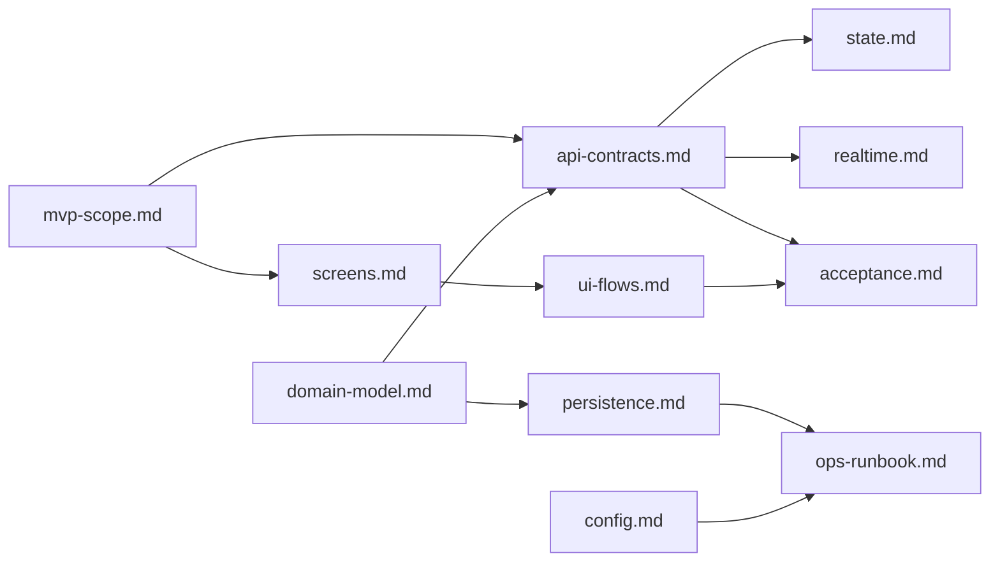

# AI-Oriented Specs Structure

## Proposed Layout
- /specs/
- /specs/overview/
- /specs/architecture/
- /specs/backend/
- /specs/frontend/
- /specs/runtime/
- /specs/qa/

### Folder Map

## Folder Purposes and Key Files
- specs/overview/
  - vision.md (goal, success criteria)
  - mvp-scope.md (in/out, assumptions, single source of truth for decisions)
  - personas.md (Host, Audience)
- specs/architecture/
  - logical-architecture.md (layered view, boundaries)
  - deployment.md (single-VM plan, services)
  - data-flow.md (join/submit/result flows)
- specs/backend/
  - api-contracts.md (routes, payloads, errors, examples)
  - domain-model.md (entities, invariants)
  - persistence.md (ERD, migrations/DDL snippets)
  - auth.md (JWT claims, expiry, refresh)
  - realtime.md (polling contract: intervals, payloads)
- specs/frontend/
  - screens.md (per-screen fields, validation, sample data)
  - state.md (client state shape, API bindings)
  - ui-flows.md (host and audience journeys)
- specs/runtime/
  - config.md (env vars, defaults)
  - ops-runbook.md (bootstrap, seed data, commands)
  - dev-env.md (tooling, versions)
- specs/qa/
  - acceptance.md (per-flow done criteria)
  - test-plan.md (MVP vs NFR expectations)
  - fixtures.md (sample payloads/codes)

### Cross-Links (What Drives What)

## Authoring Guidance (AI-Ready)
- Keep each file single-purpose, concise, and the source of truth to avoid conflicts.
- Normalize key decisions (DB choice, realtime method, testing expectations) in mvp-scope.md and reference them elsewhere.
- In api-contracts.md, use tabular route specs with concrete request/response examples and error codes.
- In persistence.md, include an ERD diagram plus minimal DDL for clarity.
- In screens.md, list fields, validations, and sample UI state per screen.
- Add sample payloads/fixtures to speed autonomous agent bootstrapping.
