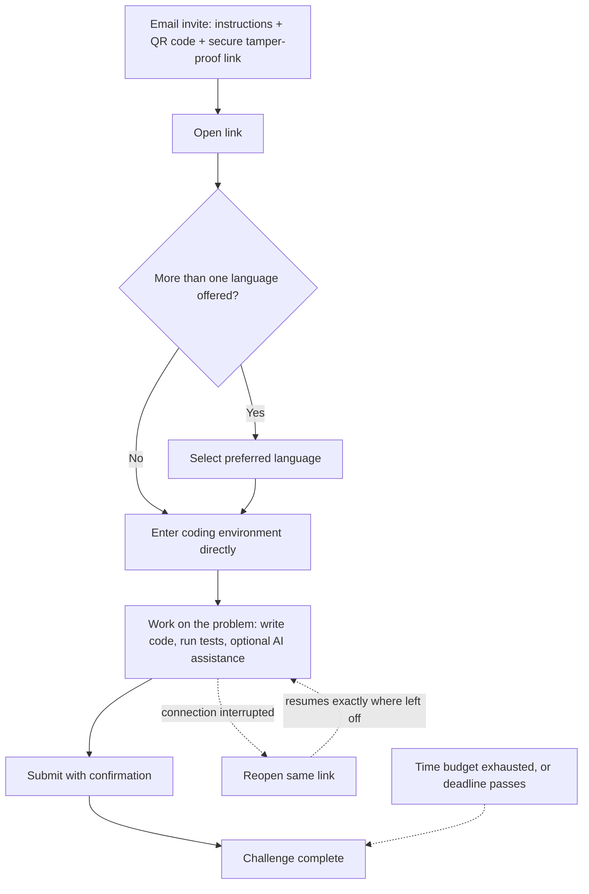
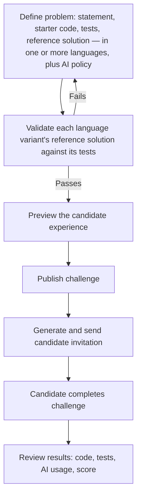

# Coding Challenge — Requirements Brief

## 1. Overview

- The Coding Challenge is a proctored assessment capability enabling candidates to complete real, executable coding problems within a secure, browser-based development environment.
- Candidates build multi-file solutions, run tests, and submit working code, rather than answering questions about code.
- Each Coding Challenge is delivered as a self-contained assessment, accessed via a dedicated, secure invitation.
- Examiners configure, per challenge, whether AI assistance is permitted; candidate performance is evaluated against criteria appropriate to that configuration.
- Functional correctness is verified through actual execution of the candidate's submitted code against a defined test suite.

## 2. Personas

| Persona | Description |
|---|---|
| Examiner | Creates and configures Coding Challenges — problem definitions, test cases, AI-assistance policy — for hiring assessments or internal skill-building initiatives; reviews individual submissions and results |
| Candidate | Completes a coding problem within an assigned Coding Challenge, as a job applicant or as an employee pursuing a learning or career-growth pathway; requires no prior account or platform login |
| Admin / Reviewer | Holds organization-wide oversight across all Coding Challenges — monitors proctoring integrity flags and AI-usage patterns, and reviews results for consistency and audit purposes, independent of who authored a given challenge |

## 3. Candidate Journey

- Opening the link takes the candidate directly into the coding environment — no separate dashboard, login, or navigation step in between.
- If the problem is offered in more than one language, the candidate selects their preferred language before starting.
- Remaining time is visible throughout, governed by both a time budget and a fixed deadline.

## 4. Examiner Journey

- The publish gate exists specifically to catch a broken problem definition — a wrong test, a bug in the reference solution — before any candidate encounters it.

## 5. Core Requirements

| Persona | Category | Requirement |
|---|---|---|
| Examiner | FR | Author a coding problem: statement, starter code, tests, reference solution, in one or more languages, and set the AI-assistance policy |
| Examiner | FR | When AI assistance is enabled, configure which AI models (e.g. Claude, Gemini) are made available to candidates for that problem |
| Examiner | FR | Publishing is blocked until the reference solution passes every test — a broken problem cannot reach candidates |
| Examiner | FR | Preview the exact candidate experience before publishing |
| Examiner | FR | Access a build-history replay showing exactly which parts of a solution originated from AI suggestions versus the candidate's own edits |
| Examiner | FR | Review candidate code, test results, AI-usage transcript, and final score after the challenge closes |
| Examiner | Security | Reference solutions and hidden test cases are never exposed to candidates |
| Candidate | FR | Access via a secure link and QR code — no separate account or login required |
| Candidate | FR | Enter the coding environment directly, with no intervening test dashboard |
| Candidate | FR | Select a language, when more than one is offered for the problem |
| Candidate | FR | Full in-browser development environment: code editor, file browser, terminal, and on-demand test execution |
| Candidate | FR | When AI assistance is enabled, choose which of the available AI models to consult for each interaction |
| Candidate | FR | AI usage is capped by a fixed budget per candidate per challenge — not unlimited; exhausting it never blocks continued coding, testing, or submission without AI |
| Candidate | FR | Whether AI output was reviewed and tested before being kept — not just whether AI was used — is part of what gets evaluated, discouraging blind acceptance of AI suggestions |
| Candidate | FR | Resume exactly where left off after a dropped connection |
| Candidate | FR | If time runs out before submitting, the candidate's last saved work is automatically submitted |
| Candidate | FR | Confirm before final submission |
| Candidate | NFR | Coding environment ready within 30 seconds of starting |
| Candidate | NFR | Editing and test runs remain near-instant — sub-second responsiveness, test results within seconds |
| Candidate | NFR | Environment availability target: 99% |
| Candidate | Security | Access, timing, and scoring are enforced entirely server-side — no client-side setting can be altered to extend time, reach another candidate's session, or influence the score |
| Candidate | Security | Hidden tests and the reference solution remain invisible throughout |
| Candidate | Security | Candidate's code and environment are fully isolated from Swaya.me's production systems and other candidates |
| Candidate | Security | Proctoring remains continuously active throughout the coding session, not only at entry, and a violation immediately locks an already-open session |
| Candidate | Security | Copy-pasting from outside the environment is blocked when AI assistance is off, to protect a human-written assessment; unrestricted when AI assistance is on |
| Candidate | Security | Submitted code and text cannot be used to compromise Swaya.me's systems, or to manipulate automated scoring through embedded instructions aimed at the AI evaluator |
| Admin/Reviewer | FR | View proctoring integrity flags and AI-usage patterns across all challenges |
| Admin/Reviewer | FR | Submissions for the same problem are checked for suspicious similarity across candidates and flagged for review |
| Admin/Reviewer | FR | Access a full activity record per candidate — submissions, test runs, AI interactions, proctoring events — for audit |
| Admin/Reviewer | Security | Candidate data (code, AI transcripts, results) is retained and handled under the organization's existing data-governance policy |

## 6. Evaluation & Scoring Approach

- Whether AI assistance was enabled fundamentally changes what a problem is assessing — so AI-assisted and human-written problems are scored against different criteria, never combined into a single blended score.
- **Human-Written Mode** assesses raw build capability — did the candidate produce correct, well-structured, working code entirely on their own.
- **AI-Assisted Mode** assesses effective AI collaboration — did the candidate direct, validate, and improve on AI output, rather than accept it uncritically. Correctness alone is a weaker signal here, since a well-prompted AI can pass tests the candidate doesn't fully understand.

| | Human-Written Mode | AI-Assisted Mode |
|---|---|---|
| Primary emphasis | Functional correctness, code quality | AI-usage efficiency, prompt quality, validation discipline |
| Secondary emphasis | Architecture, documentation, proctoring compliance | Functional correctness, code quality, architecture |
| What it answers | Can this person build working software unaided? | Can this person direct and validate an AI collaborator to reach a working result? |

**Indicative scoring parameters** (weights are configurable per organization; shown here to illustrate relative emphasis)

| Parameter | Human-Written Mode | AI-Assisted Mode |
|---|---|---|
| Functional correctness | 45% | 25% |
| Code quality | 20% | 10% |
| AI-usage efficiency | — | 20% |
| Prompt quality | — | 15% |
| Validation discipline | — | 15% |
| Architecture / structure | 10% | 5% |
| Documentation | 5% | — |
| Time taken | 5% | 5% |
| Proctoring compliance | 15% | 5% |

- All scoring is grounded in actually executing the candidate's code against defined tests, combined with objective code-quality checks and AI-generated qualitative review — so results are explainable, not a single opaque "AI opinion."
- Similarity flags across candidates are routed to the examiner for review, not applied as an automatic penalty.

## 7. Scope Boundaries

**In MVP**
- Standalone Coding Challenge, separate from the general Test/Exam feature
- Three supported languages — Python, Java, JavaScript/TypeScript — a problem may be authored in one or more
- AI assistance, toggled per problem, with examiner-curated model choice and a per-candidate token budget
- Human-Written and AI-Assisted problems scored on separate criteria
- Resumable sessions that survive a dropped connection
- Cross-candidate similarity flagging

**Deferred / Out of Scope**
- Team or pair-based assessments
- Recorded video/audio replay of a candidate's session
- Editing a candidate's package after submission
- Additional languages beyond the initial three
- Per-tenant custom environments (e.g. pre-installed internal libraries)
- Keystroke-level replay (build-history tracking is commit-level, not keystroke-level)

## 8. Success Criteria

- A candidate can go from email invite to a working coding environment with no additional setup or account creation.
- A candidate can complete a real, multi-file coding problem — writing code, running tests, and, where enabled, using AI assistance — end to end without support-staff intervention.
- A dropped connection during the challenge never results in lost work.
- Human-Written and AI-Assisted problems produce genuinely different, defensible score breakdowns.
- Examiners can author, validate, preview, and publish a problem without engineering involvement.
- Proctoring remains active and effective throughout the entire session, matching the standard already trusted for existing assessments.
- Results — code, tests, AI usage, and score — are available for every candidate immediately after the challenge closes.

## 9. Open Decisions for Sign-off

| Decision | Current MVP Direction |
|---|---|
| Initial language set | Python, Java, JavaScript/TypeScript |
| Problems per challenge | One problem per Coding Challenge at MVP |
| Candidate identity verification | Link-based access only; proctoring (not a second verification factor) is relied on to catch impersonation |
| AI provider | Cloud-based models only (e.g. Claude, Gemini); no free/local model option |
| Availability target | 99% |
| Indicative scoring weights | As shown in §6; configurable, not fixed |
