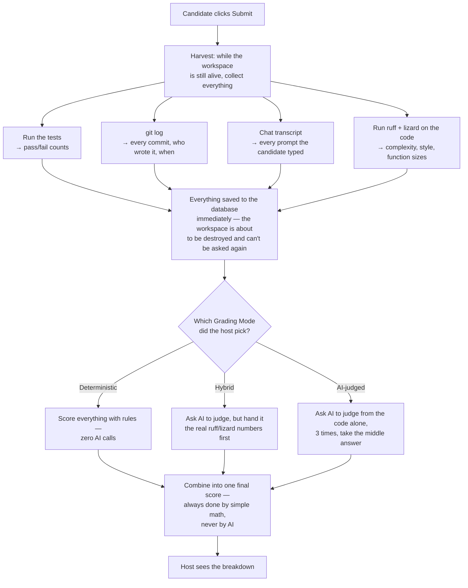
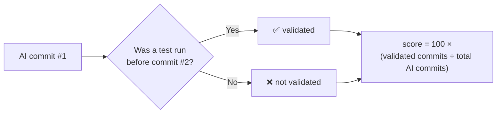
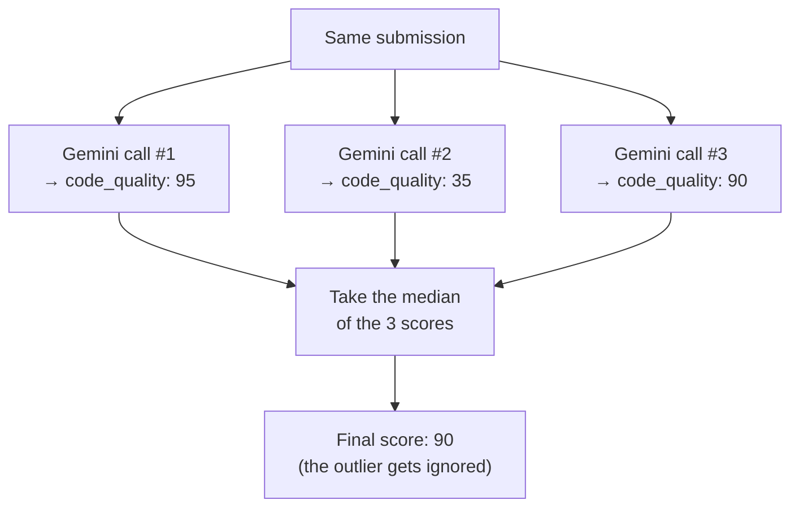
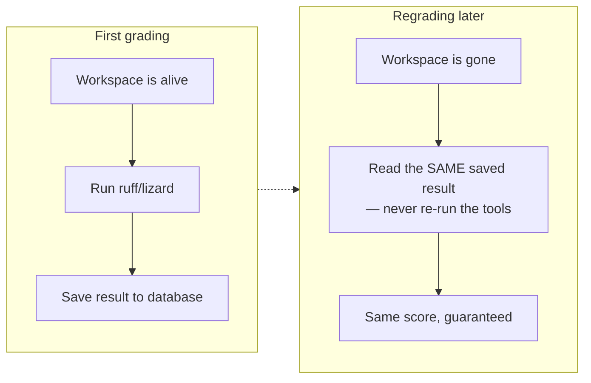

# How Deterministic Grading Works

This explains how Swaya.me grades coding-challenge submissions **without
relying on AI to make every judgment call** — and why that matters.

If you just want the short version: **"deterministic" means the same
submission always gets the same score, every time you check it, forever.**
No luck, no mood, no randomness. This document explains how we actually
achieve that.

---

## 1. The problem this solves

When Claude (or any AI) grades something, it's making a judgment call —
like a human grader would. Ask it to score the same piece of code twice,
and you can get two different answers. We measured this for real: we sent
the **exact same submission** to Gemini five times in a row, and one
criterion's score came back as:

```
95, 35, 90, 90, 90
```

Four of the five samples landed around 90. One came back 35 — a wildly
different number, for identical input. If that unlucky 35 had been the
*only* sample taken, that candidate would have been penalized for nothing
but bad luck.

For a hiring or grading decision, that's a real fairness problem. A rule
that always gives the same answer for the same input doesn't have this
problem at all.

---

## 2. Three ways to grade, host's choice

Every coding-challenge question has a **Grading Mode** the host picks:

| Mode | What it does |
|---|---|
| **Deterministic** | No AI involved at all for the criteria below. Pure rules: static-analysis tools, counting, pattern-matching. |
| **Hybrid** *(default)* | AI still judges, but it's shown real numbers from static analysis first, so it isn't just guessing from the code alone. |
| **AI-judged** | AI judges freely, like before — but asked multiple times per submission and the middle answer is used (see §5), instead of trusting a single roll of the dice. |

Three of the seven scoring criteria are **always deterministic, no matter
which mode is picked** — they never needed AI in the first place:

- **Functional Correctness** — did the code's own tests pass?
- **Time Taken** — did the candidate finish within budget?
- **Validation Discipline** — after AI wrote code, did the candidate
  actually run the tests before moving on, or just trust it blindly?

The remaining four (**AI-Usage Efficiency**, **Prompt Quality**,
**Code Quality**, **Architecture**) are the ones each mode treats
differently.

---

## 3. The grading pipeline, step by step



The key idea: **harvesting happens once, right after submission, while the
candidate's workspace still exists.** After that, the workspace is deleted.
Everything the grader needs — test results, git history, the chat
transcript, and the static-analysis numbers — is captured and saved before
that happens. This is *why* re-grading later can still work: the data is
already sitting in the database, nothing needs to be re-collected.

---

## 4. How each deterministic criterion is actually computed

No mystery, no black box — here's the literal logic for each one, in plain
terms.

### Functional Correctness (always deterministic)
```
score = 100 × (tests passed ÷ total tests)
```
Straightforward: run the tests, count.

### Time Taken (always deterministic)
Full marks if the candidate finished within the time budget. Past that,
the score decays in a straight line down to zero at double the budget.

### Validation Discipline (always deterministic)
For every commit the AI made, we check: **was a test run before the next
commit happened?** If AI wrote code and the candidate immediately kept
going without checking it worked, that's a real discipline gap — this
catches it directly from the git log and chat transcript, no guessing.



### Code Quality & Architecture (Deterministic / Hybrid modes)
We run two real, off-the-shelf tools directly inside the candidate's
workspace:

- **`lizard`** — measures how complicated each function is (cyclomatic
  complexity) and how long it is. Works for both Python and Java.
- **`ruff`** — a Python linter that flags real style/quality problems
  (unused code, overly-nested logic, etc.)

Both start every submission at **100** and lose points for things like
"this function is unusually long" or "there were N real lint warnings."
The exact thresholds live in one place in the code
(`static_analysis.py`) — a single named constant, not something scattered
around, so it's easy to see and retune.

If the tools fail to run for any reason (timeout, weird repo), the score
does **not** default to a comfortable "average" number. It defaults to a
low, penalizing number instead — because a friendly default would
otherwise be something a candidate could exploit (deliberately break the
analysis instead of submitting weak code, and get a free pass).

### AI-Usage Efficiency (Deterministic mode only)
This asks: did the candidate actually get real use out of the AI
assistant, or just poke at it randomly?

- **Zero engagement** (never used it at all) → 0. This tool is meant to be
  used, so not using it isn't neutral.
- **Very few AI-driven commits** → a real but smaller deduction ("minimal
  engagement").
- **Asking almost the same thing twice in a row** → deducted (a sign of
  the candidate not understanding the first answer, or the AI not
  understanding the request).

This formula was tuned against **9 real candidate submissions**, not
guessed — an earlier version of the rule had the direction backwards (it
assumed lots of prompts per commit was bad, but real sessions actually work
the opposite way: a handful of prompts producing many AI-driven commits is
completely normal and *good*). We caught that by testing against real data
before shipping it, not by assumption.

### Prompt Quality (Deterministic mode only) — the honest weak spot
Judging whether a prompt was genuinely *clear* requires understanding
meaning — that's exactly what no rule-based system can really do. In
Deterministic mode we still score it (rather than leaving a gap), using
surface signals instead:

- Average prompt length
- Whether prompts mention specifics (identifiers, error messages,
  requirements) versus being vague ("fix it", "make it work")

This is deliberately labeled, every time, as a **heuristic proxy — not
real judgment** in the score's own explanation text. It's the most
gameable signal in the whole system, and we say so rather than pretend
otherwise.

---

## 5. Making the AI parts more consistent too (Hybrid / AI-judged)

Even when AI is doing the judging, we made it less of a coin-flip:



We ask the same question three times and take the **middle score**, not
the average — a median naturally throws out a wild outlier like that "35"
from the real example in §1, instead of letting it drag the result down.

---

## 6. Why regrading gives the exact same answer

A host can ask us to re-check a submission's grade. In Deterministic mode,
doing that twice gives **byte-for-byte identical results** — we proved
this against a real submission, not just in theory.

The trick is simple: nothing gets recomputed from scratch. The static
analysis result and which mode was used are saved to the database the
*first* time grading happens, and every later re-check just reads those
same saved numbers back — it never reaches back into the candidate's
workspace (which, by re-grading time, has already been deleted).



---

## 7. What this can't fix (and we say so)

Being honest about the limits matters as much as the guarantees:

- **Java submissions get a slightly weaker `code_quality` check** than
  Python ones — `ruff` (the lint tool) is Python-only, so Java only gets
  the complexity check, not the style check.
- **Fixed thresholds can't know how hard a problem actually was.** A
  genuinely complex problem that needs bigger functions scores against the
  same bar as a simple one. This is the sharpest edge of "rules instead of
  judgment" — a rule can't read the problem statement and adjust.
- **Prompt Quality's heuristic is a real proxy, not real understanding.**
  It's disclosed as such everywhere it's shown, deliberately.

---

## Where the code lives

| What | File |
|---|---|
| Static analysis (ruff/lizard) | `backend/features/coding_challenge/static_analysis.py` |
| All other deterministic scoring + the mode dispatch | `backend/features/coding_challenge/grading_service_async.py` |
| Self-consistency (median-of-3) for AI-judged criteria | `backend/core/ai/base.py` |
| The 3-mode enum & database columns | `backend/persistence/models/quiz.py` |
| Tests proving all of the above | `backend/tests/test_static_analysis.py`, `backend/tests/test_coding_challenge_grading.py` |
