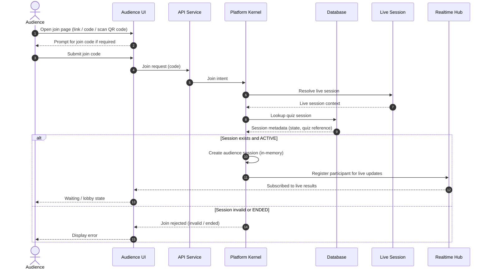
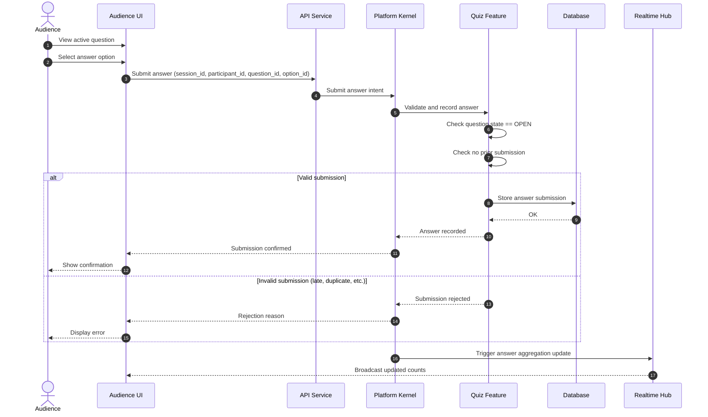
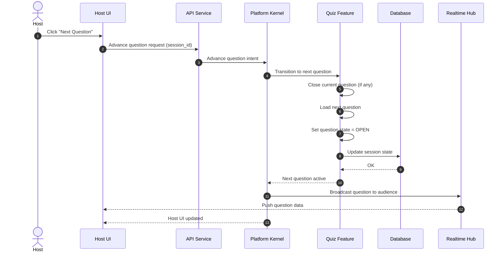
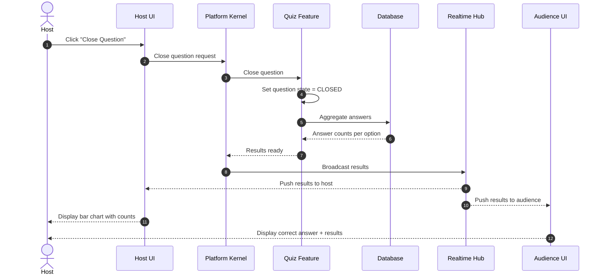
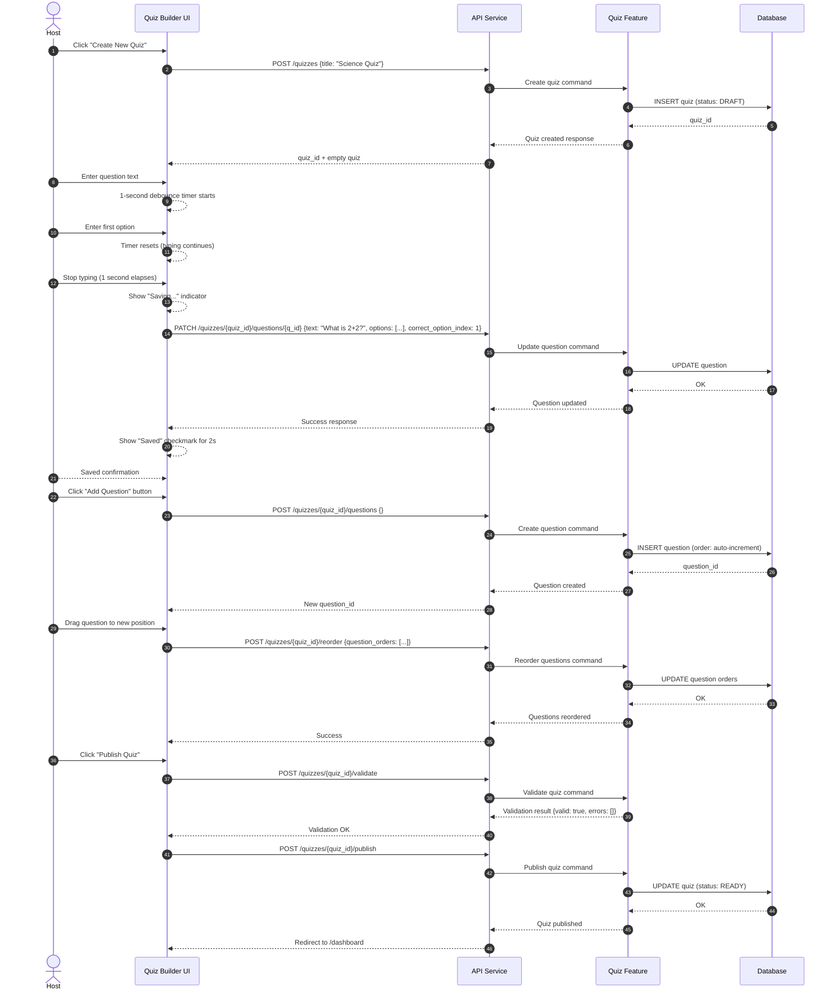

# Data Flow Diagrams

This document describes the key data flows for the Quiz MVP.

---

## Flow 1: Join Quiz (Audience)

### Description
An audience member joins an active quiz using a code or link, without requiring authentication.

### Actors
- Audience
- API Service
- Platform Kernel
- Database
- Live Session
- Realtime Hub

### Sequence



### Data Elements

**Request**:
```json
{
  "join_code": "ABC123"
}
```

**Response (Success)**:
```json
{
  "session_id": "sess_xyz",
  "participant_id": "part_123",
  "quiz_title": "Weekly Science Quiz",
  "status": "ACTIVE",
  "current_question": null
}
```

**Response (Error)**:
```json
{
  "error": "SESSION_NOT_FOUND",
  "message": "Quiz session not found or has ended"
}
```

---

## Flow 2: Submit Answer (Audience)

### Description
An audience member submits an answer to the currently active question.

### Sequence



### Data Elements

**Request**:
```json
{
  "session_id": "sess_xyz",
  "participant_id": "part_123",
  "question_id": "q_456",
  "option_id": "opt_2"
}
```

**Response (Success)**:
```json
{
  "status": "recorded",
  "question_id": "q_456",
  "selected_option": "opt_2",
  "timestamp": "2026-01-27T10:30:45Z"
}
```

**Response (Error)**:
```json
{
  "error": "SUBMISSION_REJECTED",
  "reason": "QUESTION_CLOSED",
  "message": "Question is no longer accepting answers"
}
```

---

## Flow 3: Advance Question (Host)

### Description
Host advances the quiz to the next question.

### Sequence



### Data Elements

**Request**:
```json
{
  "session_id": "sess_xyz",
  "action": "next_question"
}
```

**Response**:
```json
{
  "session_id": "sess_xyz",
  "current_question": {
    "question_id": "q_456",
    "text": "What is 2+2?",
    "options": [
      {"id": "opt_1", "text": "3"},
      {"id": "opt_2", "text": "4"},
      {"id": "opt_3", "text": "5"},
      {"id": "opt_4", "text": "6"}
    ],
    "state": "OPEN"
  }
}
```

**Realtime Broadcast (to Audience)**:
```json
{
  "type": "question_opened",
  "session_id": "sess_xyz",
  "question": {
    "question_id": "q_456",
    "text": "What is 2+2?",
    "options": [
      {"id": "opt_1", "text": "3"},
      {"id": "opt_2", "text": "4"},
      {"id": "opt_3", "text": "5"},
      {"id": "opt_4", "text": "6"}
    ]
  }
}
```

---

## Flow 4: View Results (Host & Audience)

### Description
After a question is closed, results are aggregated and displayed.

### Sequence



### Data Elements

**Results Payload**:
```json
{
  "type": "question_results",
  "session_id": "sess_xyz",
  "question_id": "q_456",
  "correct_option": "opt_2",
  "results": [
    {"option_id": "opt_1", "count": 12, "percentage": 15},
    {"option_id": "opt_2", "count": 60, "percentage": 75},
    {"option_id": "opt_3", "count": 6, "percentage": 7.5},
    {"option_id": "opt_4", "count": 2, "percentage": 2.5}
  ],
  "total_responses": 80
}
```

---

## Summary

These data flows demonstrate:
- Clear separation between Services, Platform, and Features
- Realtime broadcasting for live updates
- Answer validation and aggregation in Quiz Feature
- Host control over quiz progression

---

## Flow 5: Create and Edit Quiz (Host - Quiz Builder)

### Description
A host creates a new quiz, adds questions, and saves changes with autosave.

### Actors
- Host
- Frontend UI
- API Service (Quiz endpoints)
- Database
- Quiz Feature

### Sequence



### JSON Payloads

**Create Quiz**:
```json
POST /quizzes
{
  "title": "Weekly Science Quiz",
  "description": "Test your knowledge"
}

Response (201 Created):
{
  "quiz_id": "qz_789",
  "title": "Weekly Science Quiz",
  "status": "DRAFT",
  "created_at": "2026-01-27T10:00:00Z"
}
```

**Add Question**:
```json
POST /quizzes/{quiz_id}/questions
{
  "text": "What is 2+2?",
  "options": [
    {"text": "3", "order": 1},
    {"text": "4", "order": 2},
    {"text": "5", "order": 3},
    {"text": "6", "order": 4}
  ],
  "correct_option_index": 1
}

Response (201 Created):
{
  "question_id": "q_456",
  "order": 1,
  "text": "What is 2+2?",
  "options": [
    {"option_id": "opt_1", "text": "3", "order": 1},
    {"option_id": "opt_2", "text": "4", "order": 2},
    {"option_id": "opt_3", "text": "5", "order": 3},
    {"option_id": "opt_4", "text": "6", "order": 4}
  ],
  "correct_option_id": "opt_2"
}
```

**Validate Quiz**:
```json
POST /quizzes/{quiz_id}/validate

Response (200 OK):
{
  "valid": true,
  "errors": []
}

OR (Invalid):
{
  "valid": false,
  "errors": [
    "Quiz must have at least 1 question",
    "Question 1: missing correct answer"
  ]
}
```

**Publish Quiz**:
```json
POST /quizzes/{quiz_id}/publish

Response (200 OK):
{
  "quiz_id": "qz_789",
  "status": "READY",
  "published_at": "2026-01-27T10:20:00Z"
}
```

---

## Updated Summary

These data flows demonstrate:
- Clear separation between Services, Platform, and Features
- Quiz builder autosave with 1-second debounce
- Validation before publishing
- Batch API calls for PATCH operations
- Realtime broadcasting for live updates
- Answer validation and aggregation in Quiz Feature
- Host control over quiz progression
