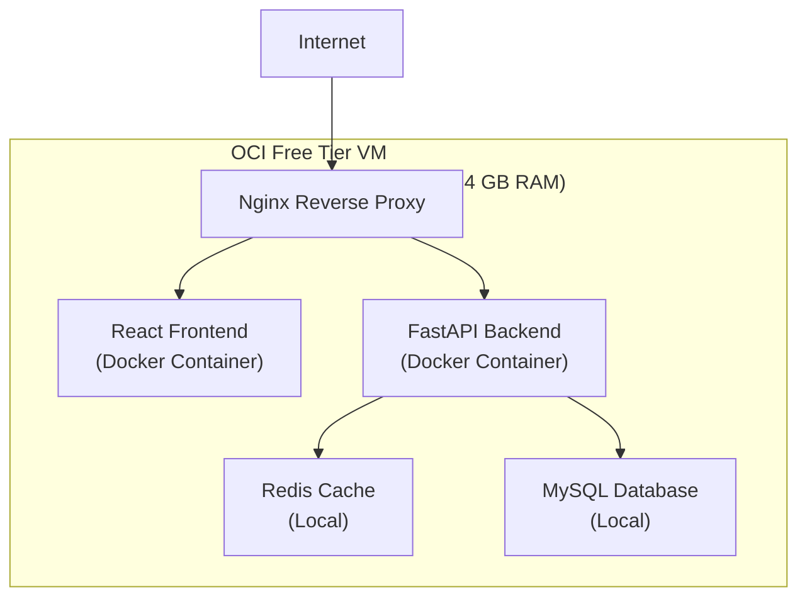

# Deployment Architecture (MVP)

## Overview

This document describes the deployment architecture for the MVP phase.

The MVP runs on:
- A single Oracle Cloud Infrastructure (OCI) Free Tier VM
- All services hosted on the same VM (MySQL, Redis, application)
- No external managed cloud services
- Modular monolith deployment model

---

## Deployment Model (MVP)

### Single VM Architecture

All application components run within a single OCI IaaS Linux VM:
- API service
- Realtime service
- Platform kernel
- Quiz feature
- Nginx reverse proxy
- Redis (local)

This minimizes:
- Operational complexity
- Cost
- Latency

---

## Infrastructure Components

### Compute Instance

| Component | Provider | Configuration | Purpose |
|-----------|----------|---------------|---------|
| **VM Instance** | Oracle Cloud Infrastructure (OCI) Free Tier | AMD/ARM-based, Ubuntu 24.04 LTS | Hosts all application services |
| **Resources** | OCI | 4 OCPU, 24 GB RAM, 97 GB SSD | Sufficient for MVP pilot |
| **Region** | OCI | ap-south-1 (or equivalent) | Primary deployment region |

### Database Hosting

| Component | Provider | Configuration | Purpose |
|-----------|----------|---------------|---------|
| **MySQL** | OCI VM (local) | MySQL 8.0+ instance on same VM | Persistent relational data |
| **Redis** | OCI VM (local) | In-memory cache on same VM | Session storage, live state, rate limiting |

### Source Code Management

| Component | Tool | Configuration | Purpose |
|-----------|------|---------------|---------|
| **Git Server** | Gitea | Self-hosted on separate OCI instance (AMD, Ubuntu 24.04) | Centralized source code repository |
| **Access** | SSH/HTTPS | Team collaboration | Version control and CI/CD integration |

---

## Container & Orchestration

| Component | Technology | Usage |
|-----------|-----------|--------|
| **Container Runtime** | Docker | Package application and dependencies |
| **Orchestration** | Docker Compose | Manage multi-container deployments |
| **Reverse Proxy** | Nginx | Route traffic to frontend and backend |

---

## Deployment Diagram

---

## Execution Boundaries

### Client Layer
- Browser-based hosts and audience participants
- Anonymous audience (no authentication)

### Services Layer
**API Service**:
- Handles request/response interactions (create quiz, start quiz, join quiz, submit answer)

**Realtime Service**:
- Manages live connections (WebSocket or polling)
- Message fan-out for questions, answers, results

### Platform Kernel
- Quiz session lifecycle management
- Feature orchestration
- Tenant context resolution (single-tenant MVP)
- Policy enforcement

### Feature Layer (MVP)
**Quiz Feature**:
- Quiz definition
- Question sequencing
- Answer evaluation
- Result aggregation

---

## Persistence & Runtime State

### MySQL (Local VM)
- Users
- Quiz definitions
- Quiz sessions
- Questions and answers
- Results

### Redis (Local VM)
- Live quiz session state
- Active participant sessions
- Rate limiting counters
- Realtime message queue (if needed)

---

## Scalability Path

### Phase 1 – MVP (Current)
- Single VM
- Single process (modular monolith)
- In-memory session state via Redis

### Phase 2 – Growth
- Multiple VMs (load balancer)
- Stateless API services
- Shared Redis (externalized)
- Read replicas for MySQL

### Phase 3 – Expansion
- Realtime service separation
- Feature-level scaling
- Kubernetes orchestration
- CDN for static assets
- Multi-region deployment

---

## Security Considerations

- HTTPS enforced via Nginx
- JWT tokens for host authentication
- Redis protected (localhost only, no external access)
- MySQL on RDS with VPC isolation
- Firewall rules: only ports 80, 443, 22 exposed

---

## Deployment Steps (MVP)

1. Provision OCI VM (Ubuntu 24.04, 4 OCPU, 24 GB RAM)
2. Install Docker and Docker Compose
3. Install and configure MySQL 8.0+
4. Clone repository from Gitea
5. Configure environment variables (DB connection, JWT secret, Redis host)
6. Build Docker images for frontend and backend
7. Start services via Docker Compose
8. Configure Nginx reverse proxy
9. Run database migrations (Alembic)
10. Start application and validate health checks

---

## Monitoring & Logging (MVP)

- Application logs via stdout (captured by Docker)
- Nginx access and error logs
- Basic health check endpoints (`/health`, `/ping`)
- No centralized monitoring (post-MVP: Prometheus, ELK)

---

## Backup & Recovery (MVP)

- MySQL automated backups via RDS (7-day retention)
- Redis ephemeral (no backup, session loss acceptable)
- Application code versioned in Gitea
- Manual VM snapshots via OCI console

---

## Rationale

### Why Single VM?
- Simplifies MVP deployment
- Reduces operational complexity
- Sufficient for pilot scale (500-1000 users)
- Architecture supports future scaling

### Why MySQL on RDS?
- Production-grade reliability
- Managed backups and updates
- Familiar relational model
- Supports future multi-tenant growth

### Why Redis Local?
- Fast ephemeral state storage
- Session management
- Live quiz state caching
- Can be externalized later

### Why Docker?
- Consistent local development and production environments
- Easy dependency management
- Supports future Kubernetes migration

---

## Non-Goals (MVP)

- Multi-region deployment
- Auto-scaling infrastructure
- CDN for static assets
- CI/CD pipelines (manual deployment)
- Centralized logging/monitoring
- High availability (single VM acceptable)
