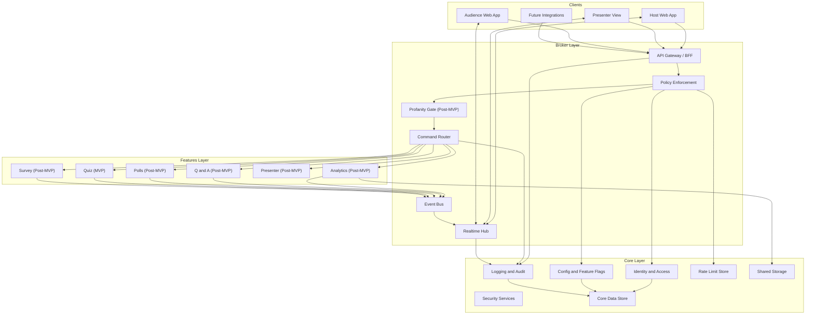

# Logical Architecture (3-Layer Model)

This document defines the **high-level logical architecture** for **Swaya.me** using a **strict 3-layer model**:

1. **Core Layer** – foundational, cross-cutting platform capabilities
2. **Broker Layer** – communication, policy enforcement, and orchestration
3. **Features Layer** – independently deployable product capabilities (Quiz, Q&A, Polls, etc.)

**Technology Commitment:** All architectural components implemented using 100% open source and free software (MIT, Apache 2.0, BSD, GPL licenses).

The architecture is designed to:
- Keep **Core stable and reusable**
- Centralize **policy enforcement** (auth, rate limits, profanity, security)
- Allow **Features to evolve independently** without coupling to platform concerns
- Maintain **full portability** across deployment environments

---

## Architectural Principles

- **Separation of Concerns**: Core never depends on Features; Features never talk directly to clients
- **Single Ingress**: All client traffic flows through the Broker
- **Policy First**: Security, rate limits, profanity, and moderation enforced before business logic
- **Realtime Safe by Design**: Nothing unapproved is ever broadcast
- **Future-Proof**: Features can be deployed independently or split later without redesign

---

## Layer Overview

| Layer | Responsibility | Stability |
|------|---------------|-----------|
| **Core** | Platform foundation & governance | Very High |
| **Broker** | Routing, policies, realtime | High |
| **Features** | Product capabilities | Medium |

---

## Core Layer (Platform Foundation)

**Purpose**: Provide shared, cross-cutting capabilities used by every feature without duplication.

### Responsibilities

#### Identity & Access Management
- Host authentication (email/password, future OAuth)
- Audience session identity (anonymous or named)
- Role-based access control (Host, Moderator, Audience)
- Token issuance and verification

#### Security Services
- Secure token handling
- Encryption in transit and at rest
- CSRF and XSS protection primitives
- Secure headers and request validation

#### Configuration & Feature Flags
- Event-level policies (moderation, profanity, rate limits)
- Global feature toggles
- Progressive rollout support

#### Logging, Auditing & Observability
- Structured application logs
- Metrics and traces
- Audit logs (mandatory for moderation and profanity actions)

#### Data Persistence (Core Data)
- Users
- Events
- Roles and permissions
- Audience sessions
- Event configuration

#### Shared Storage
- Exported analytics (CSV/JSON)
- Generated artifacts (future: word cloud images, etc.)

#### Rate Limiting & Abuse Controls
- Per-event throttles
- Per-session throttles
- IP/device fingerprint support

---

## Broker Layer (Communication & Orchestration)

**Purpose**: Act as the **single entry point** and **traffic controller** between clients, core services, and feature components.

### Responsibilities

#### API Gateway / Backend-for-Frontend (BFF)
- Unified API surface for Host, Audience, and Presenter UIs
- Input validation
- API versioning
- Response shaping

#### Policy Enforcement (MANDATORY)
All requests pass through policy checks before reaching features:
- Authentication & authorization
- Role validation
- **Rate limiting** (3-tier: Nginx edge + Slowapi application + Redis state)
- Anti-spam rules
- **Profanity detection & enforcement** (post-MVP)

**Rate Limiting Implementation (MVP)**:
- **Tier 1 (Nginx)**: Edge-level protection, DDoS mitigation, basic IP rate limits
- **Tier 2 (Slowapi)**: Context-aware application rate limiting
  - Per-IP: Login (5/min), Join session (10/min)
  - Per-participant: Answer submission (100/min)
  - Per-role: Host vs Audience differentiation
- **Tier 3 (Redis)**: Distributed rate limit counters and state management
- **HTTP 429 Response**: Rate limit exceeded with Retry-After header
- **Structured Logging**: All violations logged for analytics and abuse detection

**Profanity Rules (Post-MVP)**:
- Applied to all user-generated text (questions, poll options, quiz answers, word cloud, display names)
- Enforcement happens **server-side only**
- Event-level modes: reject, mask, or route to moderation
- Profane content must never reach feature services, be stored unsanitized, or be broadcast

#### Realtime Hub
- WebSocket / SSE handling
- Event-scoped rooms
- Controlled broadcasting of approved content only
- Reconnect and resume support

#### Command Routing & Orchestration
- Routes validated commands to appropriate feature component
- Decouples client intent from feature implementation
- Enforces feature boundaries

#### Event Bus / Messaging
- Publishes domain events (async)
- Enables analytics aggregation, audit logging, notifications
- Prevents tight coupling between features

---

## Features Layer (Product Capabilities)

**Purpose**: Deliver end-user functionality as **modular, independently deployable components**.

### Design Rules for Features
- No direct client access
- No direct auth or policy logic
- No direct broadcasting
- Communicate only through the Broker
- Own only their domain logic

### Feature Components

#### Quiz Feature (MVP)
- Quiz definition
- Question sequencing
- Answer evaluation
- Result aggregation

#### Q&A Feature (Post-MVP)
- Submit questions
- Upvote
- Sort (new, trending)
- Highlight and mark answered
- Moderation queue support

#### Polls Feature (Post-MVP)
- Multiple Choice (single/multi select)
- Rating polls
- Ranking polls
- Open text polls
- Word cloud generation

#### Survey Feature (Post-MVP)
- Multi-question flows
- Optional branching

#### Presenter Mode (Post-MVP)
- Optimized read-only views
- Large typography
- High-contrast layouts
- Embed/projector support

#### Analytics & Exports (Post-MVP)
- Aggregates domain events
- Engagement metrics
- CSV/JSON export generation

---

## Logical Architecture Diagram

---

## Text Input Flow (Policy-First) — Post-MVP

1. Client submits text input
2. Broker API Gateway receives request
3. Policy Enforcement: AuthZ, rate limits, profanity detection
4. Based on event policy: Reject OR Mask OR Send to moderation
5. Only sanitized/approved content: Reaches feature service, is stored, is broadcast via realtime hub

---

## Scalability & Evolution

- Core scales conservatively and changes slowly
- Broker scales horizontally and handles spikes
- Features scale independently (polls and word cloud may spike writes)
- Messaging layer enables async growth without coupling

---

## Implementation Guidance

### For MVP
- Implement Core + Broker as modular services in one backend
- Implement Features as isolated modules
- Keep contracts (APIs/events) stable

### For V1+
- Extract features into independent services
- Introduce shared pub/sub for realtime scaling
- Add external integrations (Slides, Zoom, Teams)

---

## Summary

This 3-layer architecture ensures:
- Strong governance and safety guarantees
- Clean feature evolution
- Zero profanity leakage (post-MVP)
- Slido-like scalability and UX
- Long-term maintainability
