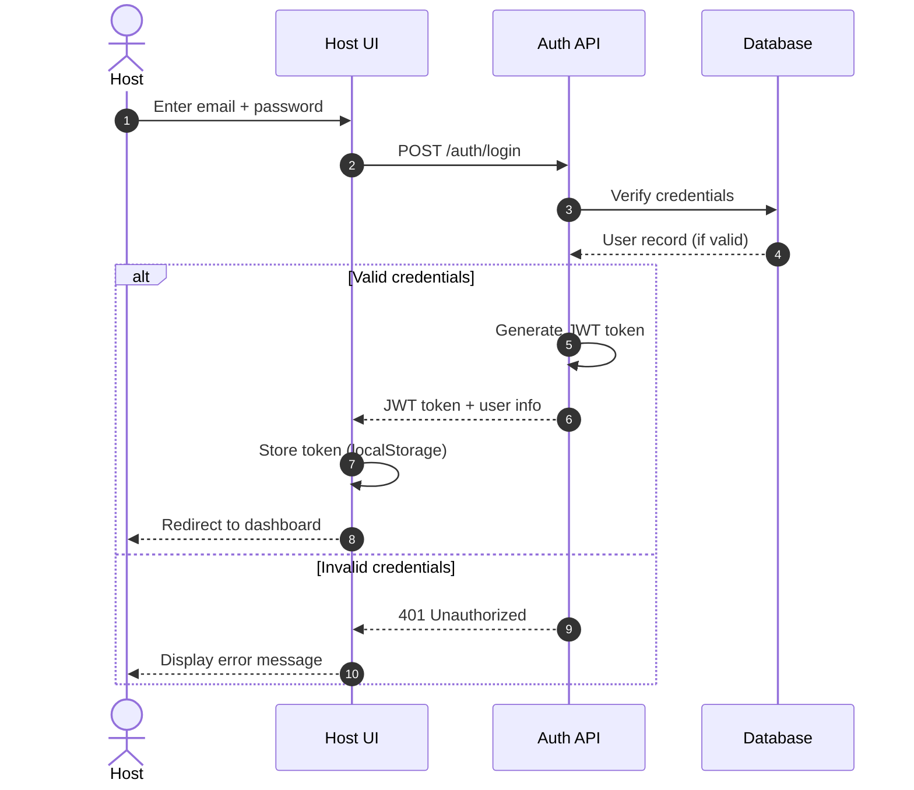

# Authentication & Authorization

This document defines the authentication and authorization mechanisms for the Swaya.me platform.

---

## Overview

The MVP uses a **simple JWT-based authentication** model with two user types:
- **Host**: Authenticated users who create and manage quizzes
- **Audience**: Anonymous participants who join quiz sessions

---

## Host Authentication

### Authentication Flow



### JWT Token Structure

**Claims**:
```json
{
  "sub": "user_id",
  "email": "host@example.com",
  "role": "host",
  "iat": 1234567890,
  "exp": 1234654290
}
```

**Token Properties**:
- **Algorithm**: HS256 (HMAC with SHA-256)
- **Expiration**: 24 hours (configurable)
- **Secret**: Stored in environment variable `JWT_SECRET`
- **Refresh**: Not implemented in MVP (re-login required)

### Password Security

- Passwords hashed using **bcrypt** (cost factor: 12)
- Plain text passwords never stored
- Password requirements (MVP):
  - Minimum 8 characters
  - At least 1 uppercase letter
  - At least 1 lowercase letter
  - At least 1 digit

### Protected Endpoints

All host actions require valid JWT token in `Authorization` header:
```
Authorization: Bearer <jwt_token>
```

**Protected Routes** (MVP):
- `POST /quizzes` — Create quiz
- `PATCH /quizzes/{quiz_id}` — Update quiz
- `POST /quizzes/{quiz_id}/questions` — Add question
- `POST /quizzes/{quiz_id}/sessions` — Start quiz session
- `POST /sessions/{session_id}/advance` — Advance question
- `POST /sessions/{session_id}/end` — End session

---

## Audience Authentication

### Anonymous Access

Audience members do NOT require authentication.

**Join Flow**:
1. Audience receives join code or link
2. Enters join code (if not in URL)
3. Platform validates join code
4. If valid, ephemeral participant session created
5. Participant receives `participant_id` in response
6. Participant ID used for subsequent actions (submit answer)

**Session Binding**:
- Participant session stored in **Redis** (ephemeral)
- Session tied to `session_id` and `join_code`
- No cross-session identity
- Session cleared when quiz ends

**Security**:
- Join code is 6-character alphanumeric (case-insensitive)
- Join code valid only while session is ACTIVE
- Rate limiting on join attempts (10 per minute per IP)

---

## Authorization Model (RBAC)

### Roles

| Role | Description | Scope |
|------|-------------|-------|
| **Host** | Quiz creator and session manager | Can create/edit/start/end own quizzes |
| **Audience** | Anonymous participant | Can join session, submit answers, view results |

### Authorization Rules (MVP)

| Action | Host | Audience |
|--------|------|----------|
| Create quiz | ✅ | ❌ |
| Edit quiz | ✅ (own only) | ❌ |
| Start quiz session | ✅ (own only) | ❌ |
| Advance question | ✅ (own only) | ❌ |
| End session | ✅ (own only) | ❌ |
| Join session | ❌ | ✅ |
| Submit answer | ❌ | ✅ |
| View results | ✅ | ✅ |

### Ownership Enforcement

- Host can only manage quizzes they created
- Verified via `host_id` in database
- Unauthorized access returns `403 Forbidden`

---

## API Authentication Endpoints

### Login (Host)

**Endpoint**: `POST /auth/login`

**Request**:
```json
{
  "email": "host@example.com",
  "password": "SecurePass123"
}
```

**Response (Success)**:
```json
{
  "access_token": "EXAMPLE_JWT_TOKEN",
  "token_type": "bearer",
  "expires_in": 86400,
  "user": {
    "user_id": "usr_123",
    "email": "host@example.com",
    "full_name": "John Doe"
  }
}
```

**Response (Error)**:
```json
{
  "error": "INVALID_CREDENTIALS",
  "message": "Invalid email or password"
}
```

### Register (Host) — Post-MVP

**Endpoint**: `POST /auth/register`

**Request**:
```json
{
  "email": "host@example.com",
  "password": "SecurePass123",
  "full_name": "John Doe"
}
```

**Response (Success)**:
```json
{
  "user_id": "usr_123",
  "email": "host@example.com",
  "message": "Registration successful"
}
```

### Logout (Host) — Post-MVP

**Endpoint**: `POST /auth/logout`

**Headers**:
```
Authorization: Bearer <jwt_token>
```

**Response**:
```json
{
  "message": "Logged out successfully"
}
```

**Note**: In MVP, logout is client-side only (remove token from localStorage).

---

## Join Session (Audience)

**Endpoint**: `POST /sessions/join`

**Request**:
```json
{
  "join_code": "ABC123"
}
```

**Response (Success)**:
```json
{
  "session_id": "sess_xyz",
  "participant_id": "part_456",
  "quiz_title": "Weekly Science Quiz",
  "status": "ACTIVE"
}
```

**Response (Error)**:
```json
{
  "error": "SESSION_NOT_FOUND",
  "message": "Quiz session not found or has ended"
}
```

---

## Security Best Practices

### Token Storage
- Store JWT in **httpOnly cookie** (preferred) OR **localStorage** (MVP acceptable)
- Never store token in plain text or session storage
- Clear token on logout

### HTTPS Only
- All authentication endpoints require HTTPS in production
- Redirect HTTP to HTTPS via Nginx

### Rate Limiting
- Login: 5 attempts per minute per IP
- Join session: 10 attempts per minute per IP
- Answer submission: 100 per minute per participant

### CORS Configuration
- Allow frontend domain only
- No wildcard (`*`) origins in production
- Credentials allowed for httpOnly cookies

---

## Error Codes

| Code | HTTP Status | Description |
|------|-------------|-------------|
| `INVALID_CREDENTIALS` | 401 | Email/password incorrect |
| `UNAUTHORIZED` | 401 | Missing or invalid JWT token |
| `FORBIDDEN` | 403 | Insufficient permissions |
| `SESSION_NOT_FOUND` | 404 | Join code invalid or session ended |
| `RATE_LIMIT_EXCEEDED` | 429 | Too many requests |

---

## Future Enhancements (Post-MVP)

- OAuth 2.0 / SSO (Google, Okta, SAML)
- Multi-factor authentication (MFA)
- Refresh tokens
- Role-based permissions (Moderator, Admin)
- API keys for integrations
- Audit logging for authentication events
