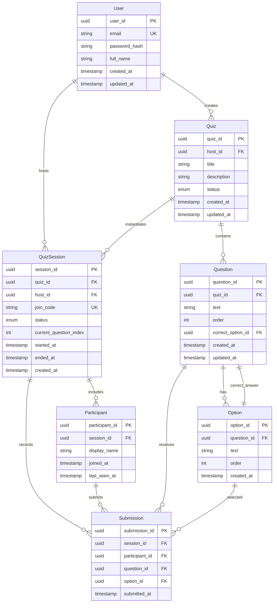

# Domain Model (Quiz Feature)

This document defines the core domain entities, relationships, and invariants for the Quiz feature.

---

## Core Entities

### Quiz Definition

A reusable description of a quiz that defines questions and correct answers independent of live play.

**Properties**:
- `quiz_id` (UUID, primary key)
- `title` (string, required)
- `description` (string, optional)
- `host_id` (UUID, foreign key to User)
- `created_at` (timestamp)
- `updated_at` (timestamp)
- `status` (enum: DRAFT, READY, ARCHIVED)

**Relationships**:
- Has many Questions
- Belongs to one Host (User)

**Invariants**:
- Quiz must have at least one question to transition from DRAFT to READY
- Quiz cannot be modified during live session
- Quiz title is required and non-empty

---

### Question

A single prompt presented to the audience during a quiz session.

**Properties**:
- `question_id` (UUID, primary key)
- `quiz_id` (UUID, foreign key to Quiz)
- `text` (string, required)
- `order` (integer, required)
- `correct_option_id` (UUID, foreign key to Option)
- `created_at` (timestamp)
- `updated_at` (timestamp)

**Relationships**:
- Belongs to one Quiz
- Has many Options (exactly 4 for MVP)
- Has one correct Option

**Invariants**:
- Question must have exactly 4 options (MVP constraint)
- One and only one option must be marked correct
- Question order must be unique within quiz
- Question text is required and non-empty

---

### Option

A possible answer choice for a question.

**Properties**:
- `option_id` (UUID, primary key)
- `question_id` (UUID, foreign key to Question)
- `text` (string, required)
- `order` (integer, required)
- `created_at` (timestamp)

**Relationships**:
- Belongs to one Question

**Invariants**:
- Option text is required and non-empty
- Option order must be unique within question
- Exactly 4 options per question (MVP)

---

### Quiz Session

A live runtime instance of a quiz being played.

**Properties**:
- `session_id` (UUID, primary key)
- `quiz_id` (UUID, foreign key to Quiz)
- `host_id` (UUID, foreign key to User)
- `join_code` (string, unique, 6 characters)
- `status` (enum: CREATED, ACTIVE, ENDED)
- `current_question_index` (integer, nullable)
- `started_at` (timestamp, nullable)
- `ended_at` (timestamp, nullable)
- `created_at` (timestamp)

**Relationships**:
- References one Quiz
- Belongs to one Host (User)
- Has many Participants
- Has many Submissions

**Invariants**:
- Join code must be unique and active
- Session can only be started once
- Session cannot transition backward (e.g., ENDED → ACTIVE)
- Current question index must be within valid range
- Only one question active at a time

**State Transitions**:
```
CREATED → ACTIVE → ENDED
```

---

### Participant

A session-scoped representation of an audience member.

**Properties**:
- `participant_id` (UUID, primary key)
- `session_id` (UUID, foreign key to Quiz Session)
- `display_name` (string, optional)
- `joined_at` (timestamp)
- `last_seen_at` (timestamp)

**Relationships**:
- Belongs to one Quiz Session
- Has many Submissions

**Invariants**:
- Participant is session-scoped (no cross-session identity)
- Participant is anonymous (no authentication)
- Participant is ephemeral (cleared on session end)

---

### Submission

A participant's answer to a question during a live session.

**Properties**:
- `submission_id` (UUID, primary key)
- `session_id` (UUID, foreign key to Quiz Session)
- `participant_id` (UUID, foreign key to Participant)
- `question_id` (UUID, foreign key to Question)
- `option_id` (UUID, foreign key to Option)
- `submitted_at` (timestamp)

**Relationships**:
- Belongs to one Quiz Session
- Belongs to one Participant
- References one Question
- References one Option

**Invariants**:
- One submission per participant per question
- Submissions cannot be changed after recording
- Submissions only accepted when question state is OPEN
- Late submissions (after close) are rejected

---

### User (Host)

A registered user who creates and manages quizzes.

**Properties**:
- `user_id` (UUID, primary key)
- `email` (string, unique, required)
- `password_hash` (string, required)
- `full_name` (string, optional)
- `created_at` (timestamp)
- `updated_at` (timestamp)

**Relationships**:
- Has many Quiz Definitions
- Has many Quiz Sessions

**Invariants**:
- Email must be unique
- Password must be hashed (never stored plain text)
- Email format must be valid

---

## Entity Relationship Diagram



---

## Aggregates

### Quiz Aggregate
- **Root**: Quiz Definition
- **Members**: Questions, Options
- **Boundary**: Quiz definition lifecycle
- **Rules**: Quiz cannot be deleted if active sessions exist

### Session Aggregate
- **Root**: Quiz Session
- **Members**: Participants, Submissions
- **Boundary**: Live quiz play
- **Rules**: Session state controls all operations

---

## Domain Events (Post-MVP)

- `QuizCreated`
- `QuizPublished`
- `SessionStarted`
- `QuestionOpened`
- `AnswerSubmitted`
- `QuestionClosed`
- `SessionEnded`

These events enable:
- Analytics aggregation
- Audit logging
- Realtime broadcasting

---

## Business Rules Summary

| Rule Area | Description | Enforcement |
|----------|-------------|-------------|
| Quiz Definition | Must have ≥1 question to be READY | Application layer |
| Question Structure | Exactly 4 options, 1 correct | Application + DB constraint |
| Session State | No backward transitions | Application layer |
| Answer Submission | One per participant per question | DB unique constraint |
| Submission Timing | Only when question OPEN | Application layer |
| Answer Mutability | Cannot change after submission | Application layer |

---

## Data Integrity Constraints

### Database Constraints
- Primary keys: UUID (non-sequential, globally unique)
- Foreign keys: CASCADE on delete for owned entities, RESTRICT for references
- Unique constraints: email, join_code, (participant_id, question_id)
- Not null constraints: All required fields

### Application-Level Validations
- Email format validation
- Join code generation (6-character alphanumeric, case-insensitive)
- Question order validation
- State transition validation
- Answer submission timing validation

---

## Performance Considerations

- **Indexing**: 
  - join_code (frequent lookups)
  - session_id + question_id (submission queries)
  - host_id (quiz ownership queries)
- **Caching**: 
  - Active quiz sessions (Redis)
  - Current question state (Redis)
  - Participant sessions (Redis)
- **Aggregation**: 
  - Answer counts computed on question close
  - Cached for realtime display
