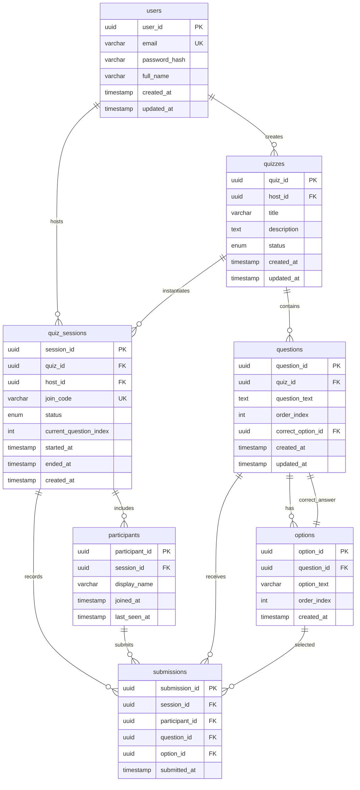

# Database Persistence (MySQL)

This document defines the database schema, tables, relationships, and migration strategy for the Swaya.me MVP.

**All database and ORM technologies are 100% open source and free.**

---

## Database Technology (All Open Source)

- **RDBMS**: MySQL 8.0+ (GPL v2 License)
- **Hosting**: OCI VM (local installation on open source Ubuntu Linux)
- **ORM**: SQLAlchemy 2.0 (MIT License)
- **Migrations**: Alembic (MIT License)
- **Database Driver**: PyMySQL (MIT License) or mysqlclient (GPL)
- **Connection Pooling**: Built-in SQLAlchemy pooling (open source)

---

## Schema Design Principles

- **UUIDs as Primary Keys**: Globally unique, non-sequential
- **Timestamps**: All tables include `created_at` and `updated_at`
- **Foreign Key Constraints**: Enforce referential integrity
- **Indexes**: On frequently queried columns (join_code, session_id, etc.)
- **Soft Deletes**: Not implemented in MVP (hard deletes only)

---

## Entity Relationship Diagram



---

## Table Definitions (DDL)

### users

```sql
CREATE TABLE users (
    user_id CHAR(36) PRIMARY KEY,
    email VARCHAR(255) NOT NULL UNIQUE,
    password_hash VARCHAR(255) NOT NULL,
    full_name VARCHAR(255),
    created_at TIMESTAMP DEFAULT CURRENT_TIMESTAMP,
    updated_at TIMESTAMP DEFAULT CURRENT_TIMESTAMP ON UPDATE CURRENT_TIMESTAMP,
    INDEX idx_email (email)
);
```

### quizzes

```sql
CREATE TABLE quizzes (
    quiz_id CHAR(36) PRIMARY KEY,
    host_id CHAR(36) NOT NULL,
    title VARCHAR(255) NOT NULL,
    description TEXT,
    status ENUM('DRAFT', 'READY', 'ARCHIVED') DEFAULT 'DRAFT',
    created_at TIMESTAMP DEFAULT CURRENT_TIMESTAMP,
    updated_at TIMESTAMP DEFAULT CURRENT_TIMESTAMP ON UPDATE CURRENT_TIMESTAMP,
    FOREIGN KEY (host_id) REFERENCES users(user_id) ON DELETE CASCADE,
    INDEX idx_host_id (host_id),
    INDEX idx_status (status)
);
```

### questions

```sql
CREATE TABLE questions (
    question_id CHAR(36) PRIMARY KEY,
    quiz_id CHAR(36) NOT NULL,
    question_text TEXT NOT NULL,
    order_index INT NOT NULL,
    correct_option_id CHAR(36),
    created_at TIMESTAMP DEFAULT CURRENT_TIMESTAMP,
    updated_at TIMESTAMP DEFAULT CURRENT_TIMESTAMP ON UPDATE CURRENT_TIMESTAMP,
    FOREIGN KEY (quiz_id) REFERENCES quizzes(quiz_id) ON DELETE CASCADE,
    FOREIGN KEY (correct_option_id) REFERENCES options(option_id) ON DELETE RESTRICT,
    UNIQUE KEY uk_quiz_order (quiz_id, order_index),
    INDEX idx_quiz_id (quiz_id)
);
```

### options

```sql
CREATE TABLE options (
    option_id CHAR(36) PRIMARY KEY,
    question_id CHAR(36) NOT NULL,
    option_text VARCHAR(255) NOT NULL,
    order_index INT NOT NULL,
    created_at TIMESTAMP DEFAULT CURRENT_TIMESTAMP,
    FOREIGN KEY (question_id) REFERENCES questions(question_id) ON DELETE CASCADE,
    UNIQUE KEY uk_question_order (question_id, order_index),
    INDEX idx_question_id (question_id)
);
```

### quiz_sessions

```sql
CREATE TABLE quiz_sessions (
    session_id CHAR(36) PRIMARY KEY,
    quiz_id CHAR(36) NOT NULL,
    host_id CHAR(36) NOT NULL,
    join_code VARCHAR(6) NOT NULL UNIQUE,
    status ENUM('CREATED', 'ACTIVE', 'ENDED') DEFAULT 'CREATED',
    current_question_index INT,
    started_at TIMESTAMP NULL,
    ended_at TIMESTAMP NULL,
    created_at TIMESTAMP DEFAULT CURRENT_TIMESTAMP,
    FOREIGN KEY (quiz_id) REFERENCES quizzes(quiz_id) ON DELETE RESTRICT,
    FOREIGN KEY (host_id) REFERENCES users(user_id) ON DELETE CASCADE,
    INDEX idx_join_code (join_code),
    INDEX idx_host_id (host_id),
    INDEX idx_status (status)
);
```

### participants

```sql
CREATE TABLE participants (
    participant_id CHAR(36) PRIMARY KEY,
    session_id CHAR(36) NOT NULL,
    display_name VARCHAR(100),
    joined_at TIMESTAMP DEFAULT CURRENT_TIMESTAMP,
    last_seen_at TIMESTAMP DEFAULT CURRENT_TIMESTAMP ON UPDATE CURRENT_TIMESTAMP,
    FOREIGN KEY (session_id) REFERENCES quiz_sessions(session_id) ON DELETE CASCADE,
    INDEX idx_session_id (session_id)
);
```

### submissions

```sql
CREATE TABLE submissions (
    submission_id CHAR(36) PRIMARY KEY,
    session_id CHAR(36) NOT NULL,
    participant_id CHAR(36) NOT NULL,
    question_id CHAR(36) NOT NULL,
    option_id CHAR(36) NOT NULL,
    submitted_at TIMESTAMP DEFAULT CURRENT_TIMESTAMP,
    FOREIGN KEY (session_id) REFERENCES quiz_sessions(session_id) ON DELETE CASCADE,
    FOREIGN KEY (participant_id) REFERENCES participants(participant_id) ON DELETE CASCADE,
    FOREIGN KEY (question_id) REFERENCES questions(question_id) ON DELETE RESTRICT,
    FOREIGN KEY (option_id) REFERENCES options(option_id) ON DELETE RESTRICT,
    UNIQUE KEY uk_participant_question (participant_id, question_id),
    INDEX idx_session_id (session_id),
    INDEX idx_question_id (question_id)
);
```

---

## Constraints Summary

| Constraint Type | Table | Description |
|----------------|-------|-------------|
| Primary Key | All | UUID-based, non-sequential |
| Unique | users.email | Email must be unique |
| Unique | quiz_sessions.join_code | Join code must be unique |
| Unique | questions (quiz_id, order_index) | Question order within quiz |
| Unique | options (question_id, order_index) | Option order within question |
| Unique | submissions (participant_id, question_id) | One submission per participant per question |
| Foreign Key | quizzes.host_id → users.user_id | CASCADE on delete |
| Foreign Key | quiz_sessions.quiz_id → quizzes.quiz_id | RESTRICT on delete |
| Foreign Key | submissions.participant_id → participants.participant_id | CASCADE on delete |

---

## Indexing Strategy

### Performance-Critical Indexes
1. **join_code** (quiz_sessions): Frequent lookups during audience join
2. **session_id + question_id** (submissions): Answer aggregation queries
3. **host_id** (quizzes, quiz_sessions): Quiz ownership queries
4. **email** (users): Authentication lookups

### Composite Indexes (Post-MVP)
- `(session_id, question_id, submitted_at)` for time-based analytics
- `(quiz_id, status)` for filtering active quizzes

---

## Data Retention (MVP)

- **Active Sessions**: Persist indefinitely (post-MVP: 6 months)
- **Ended Sessions**: Persist indefinitely (post-MVP: 12 months)
- **Submissions**: Persist indefinitely (post-MVP: 12 months)
- **Archived Quizzes**: Persist indefinitely (post-MVP: soft delete)

---

## Migration Strategy (Alembic)

### Initial Migration

```python
# alembic/versions/001_initial_schema.py
def upgrade():
    # Create users table
    op.create_table(
        'users',
        sa.Column('user_id', sa.String(36), primary_key=True),
        sa.Column('email', sa.String(255), nullable=False, unique=True),
        sa.Column('password_hash', sa.String(255), nullable=False),
        sa.Column('full_name', sa.String(255)),
        sa.Column('created_at', sa.TIMESTAMP, server_default=sa.text('CURRENT_TIMESTAMP')),
        sa.Column('updated_at', sa.TIMESTAMP, server_default=sa.text('CURRENT_TIMESTAMP ON UPDATE CURRENT_TIMESTAMP')),
    )
    op.create_index('idx_email', 'users', ['email'])
    
    # Create quizzes, questions, options, quiz_sessions, participants, submissions tables...
    # (Similar structure for each table)

def downgrade():
    op.drop_table('submissions')
    op.drop_table('participants')
    op.drop_table('quiz_sessions')
    op.drop_table('options')
    op.drop_table('questions')
    op.drop_table('quizzes')
    op.drop_table('users')
```

### Running Migrations

```bash
# Generate migration
alembic revision --autogenerate -m "Initial schema"

# Apply migrations
alembic upgrade head

# Rollback
alembic downgrade -1
```

---

## Sample Data (Fixtures)

### Seed User
```sql
INSERT INTO users (user_id, email, password_hash, full_name)
VALUES ('usr_test', 'host@example.com', '$2b$12$...', 'Test Host');
```

### Seed Quiz
```sql
INSERT INTO quizzes (quiz_id, host_id, title, description, status)
VALUES ('qz_test', 'usr_test', 'Sample Quiz', 'Test quiz for development', 'READY');
```

### Seed Question
```sql
INSERT INTO questions (question_id, quiz_id, question_text, order_index, correct_option_id)
VALUES ('q_test', 'qz_test', 'What is 2+2?', 1, 'opt_test_2');
```

### Seed Options
```sql
INSERT INTO options (option_id, question_id, option_text, order_index)
VALUES
  ('opt_test_1', 'q_test', '3', 1),
  ('opt_test_2', 'q_test', '4', 2),
  ('opt_test_3', 'q_test', '5', 3),
  ('opt_test_4', 'q_test', '6', 4);
```

---

## Connection Configuration

**Environment Variables**:
```bash
DB_HOST=<mysql-host-endpoint>
DB_PORT=3306
DB_NAME=swaya_db
DB_USER=admin
DB_PASSWORD=<secure_password>
DB_POOL_SIZE=10
DB_MAX_OVERFLOW=5
```

**SQLAlchemy Connection String**:
```python
DATABASE_URL = f"mysql+pymysql://{DB_USER}:{DB_PASSWORD}@{DB_HOST}:{DB_PORT}/{DB_NAME}"
```

---

## Backup & Recovery

- **Automated Backups**: Scheduled via cron jobs (7-day retention)
- **Manual Snapshots**: Before major schema changes
- **Point-in-Time Recovery**: Via binary logs and incremental backups
