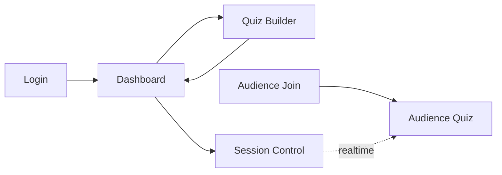

# Frontend Screens (MVP)

This document defines all screens, components, fields, and validation rules for the Swaya.me MVP frontend.

---

## Technology Stack

- **Framework**: React 18+
- **UI Library**: Ant Design (AntD)
- **State Management**: Redux Toolkit (RTK)
- **Routing**: React Router v6
- **HTTP Client**: Axios
- **Real-time**: Polling (2s interval) or WebSocket (TBD)

---

## Screen Inventory

| Screen | Route | Access | Purpose |
|--------|-------|--------|---------|
| Login | `/login` | Public | Host authentication |
| Dashboard | `/dashboard` | Host only | Quiz management |
| Quiz Builder | `/quiz/new` or `/quiz/{quiz_id}/edit` | Host only | Create/edit quiz |
| Quiz Session Control | `/session/{session_id}/control` | Host only | Run live quiz |
| Audience Join | `/join` or `/join/{join_code}` | Public | Audience entry point |
| Audience Quiz | `/session/{session_id}/play` | Audience only | Participate in quiz |

---

## Screen 1: Login (Host)

### Route
`/login`

### Purpose
Authenticate host users and issue JWT token.

### Layout
- Centered card on full-screen background
- Ant Design Form component
- Logo/branding at top

### Fields

| Field | Type | Validation | Placeholder | Required |
|-------|------|------------|-------------|----------|
| Email | Input (email) | Valid email format | host@example.com | Yes |
| Password | Input.Password | Min 8 characters | ••••••••• | Yes |

### Actions

| Action | Trigger | Behavior |
|--------|---------|----------|
| Login | Submit button | POST /auth/login, store JWT, redirect to /dashboard |
| Forgot Password | Link (disabled MVP) | Show "Coming soon" message |

### Sample State
```json
{
  "email": "host@example.com",
  "password": "SecurePass123",
  "loading": false,
  "error": null
}
```

### Error Handling
- Display error message below form (Ant Design Alert)
- Invalid credentials: "Invalid email or password"
- Rate limit: "Too many login attempts. Please try again later."

### Wireframe (Conceptual)
```
┌─────────────────────────────┐
│         [Logo]              │
│                             │
│  ┌───────────────────────┐  │
│  │ Login to Swaya.me     │  │
│  │                       │  │
│  │ Email:                │  │
│  │ [________________]    │  │
│  │                       │  │
│  │ Password:             │  │
│  │ [________________]    │  │
│  │                       │  │
│  │     [Login Button]    │  │
│  │                       │  │
│  │  Forgot password?     │  │
│  └───────────────────────┘  │
└─────────────────────────────┘
```

---

## Screen 2: Dashboard (Host)

### Route
`/dashboard`

### Purpose
List all quizzes created by host with actions.

### Layout
- Top navigation bar (logo, logout)
- Main content area with quiz list
- "Create New Quiz" button (top right)

### Components

#### Quiz List Table

| Column | Description | Actions |
|--------|-------------|---------|
| Title | Quiz title | Click to open quiz builder |
| Status | DRAFT, READY, ARCHIVED | Badge color-coded |
| Questions | Count of questions | N/A |
| Created | Date created | Formatted (e.g., Jan 27, 2026) |
| Actions | Buttons | Edit, Start Session, Delete |

### Actions

| Action | Trigger | Behavior |
|--------|---------|----------|
| Create Quiz | Button | Navigate to /quiz/new |
| Edit Quiz | Table row action | Navigate to /quiz/{quiz_id}/edit |
| Start Session | Table row action | POST /quizzes/{quiz_id}/sessions, navigate to /session/{session_id}/control |
| Delete Quiz | Table row action | Confirm modal, DELETE /quizzes/{quiz_id} |
| Logout | Top nav button | Clear JWT, redirect to /login |

### Sample State
```json
{
  "quizzes": [
    {
      "quiz_id": "qz_789",
      "title": "Weekly Science Quiz",
      "status": "READY",
      "question_count": 5,
      "created_at": "2026-01-27T10:00:00Z"
    }
  ],
  "loading": false,
  "error": null
}
```

### Wireframe (Conceptual)
```
┌──────────────────────────────────────────┐
│ [Logo]                    [+ New Quiz]   │
│                                 [Logout] │
├──────────────────────────────────────────┤
│  My Quizzes                              │
│                                          │
│  ┌────────────────────────────────────┐ │
│  │ Title         Status  Questions    │ │
│  ├────────────────────────────────────┤ │
│  │ Science Quiz  READY   5    [Edit] │ │
│  │                            [Start] │ │
│  │                          [Delete]  │ │
│  └────────────────────────────────────┘ │
└──────────────────────────────────────────┘
```

---

## Screen 3: Quiz Builder (Host)

### Route
`/quiz/new` or `/quiz/{quiz_id}/edit`

### Purpose
Create or edit quiz with questions and options.

### Layout
- Top section: Quiz metadata (title, description)
- Questions list (collapsible cards)
- Add Question button
- Save and Publish buttons

### Quiz Metadata Fields

| Field | Type | Validation | Placeholder | Required |
|-------|------|------------|-------------|----------|
| Title | Input | 1-255 characters | e.g., "Weekly Science Quiz" | Yes |
| Description | TextArea | 0-1000 characters | Optional description | No |

### Question Card Fields

| Field | Type | Validation | Placeholder | Required |
|-------|------|------------|-------------|----------|
| Question Text | TextArea | 1-500 characters | e.g., "What is 2+2?" | Yes |
| Option 1 | Input | 1-200 characters | e.g., "3" | Yes |
| Option 2 | Input | 1-200 characters | e.g., "4" | Yes |
| Option 3 | Input | 1-200 characters | e.g., "5" | Yes |
| Option 4 | Input | 1-200 characters | e.g., "6" | Yes |
| Correct Answer | Radio | Select one | Select correct option | Yes |

### Actions

| Action | Trigger | Behavior |
|--------|---------|----------|
| Save Draft | Button | POST or PATCH quiz, show "Saving..." → "Saved" indicator |
| Publish Quiz | Button | POST /quizzes/{quiz_id}/validate → if valid, POST /publish, redirect to dashboard |
| Add Question | Button | POST /quizzes/{quiz_id}/questions, append new question card |
| Delete Question | Question card action | DELETE /questions/{q_id}, remove card and re-order |
| Reorder Questions | Drag-and-drop | POST /quizzes/{quiz_id}/reorder with new order |
| Preview Quiz | Button | Navigate to read-only preview modal |
| Validate Quiz | Button | POST /quizzes/{quiz_id}/validate, show validation results |
| Cancel | Button | Navigate back to dashboard (confirm if unsaved changes) |

### Autosave Behavior
- Client-side debounce: 1 second wait after last keystroke
- Visual feedback: "Saving..." state, then "Saved" checkmark
- Batched updates: Collect all field changes in one PATCH
- Error recovery: "Save failed, retrying..." with exponential backoff
- Unsaved changes indicator: * next to quiz title if changes pending

### Validation Display
- Inline errors: Red border + error text under field
- Form-level validation: Modal with all errors listed
- Validation states:
  - ✅ All fields valid (green checkmark)
  - ⚠️ Some fields invalid (yellow warning)
  - ❌ Cannot publish (red error button disabled)

### Preview Mode
- Read-only preview of how audience sees quiz
- Shows all questions sequentially
- Display options layout exactly as participant sees
- Close preview to return to edit mode

### Sample State
```json
{
  "quiz": {
    "quiz_id": "qz_789",
    "title": "Weekly Science Quiz",
    "description": "Test your science knowledge",
    "status": "DRAFT"
  },
  "questions": [
    {
      "question_id": "q_456",
      "text": "What is 2+2?",
      "options": [
        {"option_id": "opt_1", "text": "3", "order": 1},
        {"option_id": "opt_2", "text": "4", "order": 2},
        {"option_id": "opt_3", "text": "5", "order": 3},
        {"option_id": "opt_4", "text": "6", "order": 4}
      ],
      "correct_option_index": 1
    }
  ],
  "loading": false,
  "saving": false,
  "saveError": null,
  "unsavedChanges": false,
  "error": null
}
```

### Wireframe (Conceptual)
```
┌──────────────────────────────────────────┐
│ [Back]  Quiz Builder           [Logout]  │
├──────────────────────────────────────────┤
│  Title: [_____________________________]  │
│  Description: [______________________]   │
│                                          │
│  ┌────────────────────────────────────┐ │
│  │ Question 1                [Delete] │ │
│  │ Text: What is 2+2?                 │ │
│  │ [ ] Option 1: 3                    │ │
│  │ [•] Option 2: 4  (Correct)         │ │
│  │ [ ] Option 3: 5                    │ │
│  │ [ ] Option 4: 6                    │ │
│  └────────────────────────────────────┘ │
│                                          │
│  [+ Add Question]                        │
│                                          │
│  [Save Draft]          [Publish Quiz]   │
└──────────────────────────────────────────┘
```

---

## Screen 4: Quiz Session Control (Host)

### Route
`/session/{session_id}/control`

### Purpose
Control live quiz session (start, advance, view results, end).

### Layout
- Top: Session info (join code, status, participant count)
- Center: Current question display
- Right: Live answer distribution (bar chart)
- Bottom: Action buttons

### Display Elements

| Element | Description | Updates |
|---------|-------------|---------|
| Join Code | 6-character code | Static |
| Participant Count | Total joined | Realtime (polling) |
| Current Question | Question text and options | On advance |
| Answer Distribution | Bar chart with counts | Realtime (polling) |

### Actions

| Action | Trigger | Behavior |
|--------|---------|----------|
| Start Quiz | Button (initial) | POST /sessions/{session_id}/start, open first question |
| Next Question | Button | POST /sessions/{session_id}/advance, broadcast next question |
| Close Question | Button | Close current question, show results |
| End Quiz | Button | POST /sessions/{session_id}/end, show final summary |

### Sample State
```json
{
  "session": {
    "session_id": "sess_xyz",
    "join_code": "ABC123",
    "status": "ACTIVE",
    "participant_count": 50
  },
  "current_question": {
    "question_id": "q_456",
    "text": "What is 2+2?",
    "state": "OPEN"
  },
  "live_results": [
    {"option_id": "opt_1", "text": "3", "count": 5},
    {"option_id": "opt_2", "text": "4", "count": 40},
    {"option_id": "opt_3", "text": "5", "count": 3},
    {"option_id": "opt_4", "text": "6", "count": 2}
  ],
  "loading": false,
  "error": null
}
```

### Wireframe (Conceptual)
```
┌──────────────────────────────────────────┐
│ Join Code: ABC123     Participants: 50   │
│ Status: ACTIVE                  [Logout] │
├──────────────────────────────────────────┤
│  Current Question                        │
│  What is 2+2?                            │
│                                          │
│  Live Results:                           │
│  Option 1 (3):    █████ 5 (10%)         │
│  Option 2 (4):    ████████████████ 40   │
│  Option 3 (5):    ███ 3 (6%)            │
│  Option 4 (6):    ██ 2 (4%)             │
│                                          │
│  [Close Question]    [Next Question]    │
│  [End Quiz]                              │
└──────────────────────────────────────────┘
```

---

## Screen 5: Audience Join

### Route
`/join` or `/join/{join_code}`

### Purpose
Allow audience to join active quiz session.

### Layout
- Centered card with join code input
- Logo/branding at top

### Fields

| Field | Type | Validation | Placeholder | Required |
|-------|------|------------|-------------|----------|
| Join Code | Input | 6 characters, alphanumeric | ABC123 | Yes (if not in URL) |

### Actions

| Action | Trigger | Behavior |
|--------|---------|----------|
| Join | Submit button | POST /sessions/join, navigate to /session/{session_id}/play |

### Sample State
```json
{
  "join_code": "ABC123",
  "loading": false,
  "error": null
}
```

### Wireframe (Conceptual)
```
┌─────────────────────────────┐
│         [Logo]              │
│                             │
│  ┌───────────────────────┐  │
│  │ Join Quiz             │  │
│  │                       │  │
│  │ Enter Join Code:      │  │
│  │ [________________]    │  │
│  │                       │  │
│  │     [Join Button]     │  │
│  └───────────────────────┘  │
└─────────────────────────────┘
```

---

## Screen 6: Audience Quiz

### Route
`/session/{session_id}/play`

### Purpose
View questions, submit answers, see results.

### Layout
- Top: Quiz title
- Center: Question text and options (radio buttons)
- Bottom: Submit button or results display

### Display States

| State | Description | UI |
|-------|-------------|----|
| Waiting | Quiz not started | "Waiting for host to start..." |
| Question Open | Answer submission allowed | Question + options + Submit button |
| Submitted | Answer recorded | "Answer submitted! Waiting for results..." |
| Results | Question closed | Question + correct answer + bar chart |

### Actions

| Action | Trigger | Behavior |
|--------|---------|----------|
| Submit Answer | Button | POST /sessions/{session_id}/submit, show confirmation |

### Sample State (Question Open)
```json
{
  "session": {
    "session_id": "sess_xyz",
    "quiz_title": "Weekly Science Quiz"
  },
  "current_question": {
    "question_id": "q_456",
    "text": "What is 2+2?",
    "options": [
      {"option_id": "opt_1", "text": "3"},
      {"option_id": "opt_2", "text": "4"},
      {"option_id": "opt_3", "text": "5"},
      {"option_id": "opt_4", "text": "6"}
    ],
    "state": "OPEN"
  },
  "selected_option": null,
  "submitted": false,
  "loading": false,
  "error": null
}
```

### Sample State (Results)
```json
{
  "session": {
    "session_id": "sess_xyz",
    "quiz_title": "Weekly Science Quiz"
  },
  "current_question": {
    "question_id": "q_456",
    "text": "What is 2+2?",
    "state": "CLOSED"
  },
  "results": {
    "correct_option_id": "opt_2",
    "results": [
      {"option_id": "opt_1", "text": "3", "count": 5, "percentage": 10.0},
      {"option_id": "opt_2", "text": "4", "count": 40, "percentage": 80.0},
      {"option_id": "opt_3", "text": "5", "count": 3, "percentage": 6.0},
      {"option_id": "opt_4", "text": "6", "count": 2, "percentage": 4.0}
    ]
  },
  "loading": false,
  "error": null
}
```

### Wireframe (Conceptual)
```
┌─────────────────────────────┐
│  Weekly Science Quiz        │
├─────────────────────────────┤
│  What is 2+2?               │
│                             │
│  ( ) 3                      │
│  (•) 4                      │
│  ( ) 5                      │
│  ( ) 6                      │
│                             │
│     [Submit Answer]         │
└─────────────────────────────┘
```

---

## Navigation Flow



---

## Component Library (Ant Design)

| Component | Usage |
|-----------|-------|
| Form | Login, Quiz Builder |
| Input | Text fields |
| Input.Password | Password field |
| Button | Primary actions |
| Table | Quiz list |
| Card | Quiz metadata, questions |
| Radio | Answer selection |
| Alert | Error messages |
| Modal | Confirm dialogs |
| Progress | Answer distribution (Bar type) |
| Spin | Loading states |
