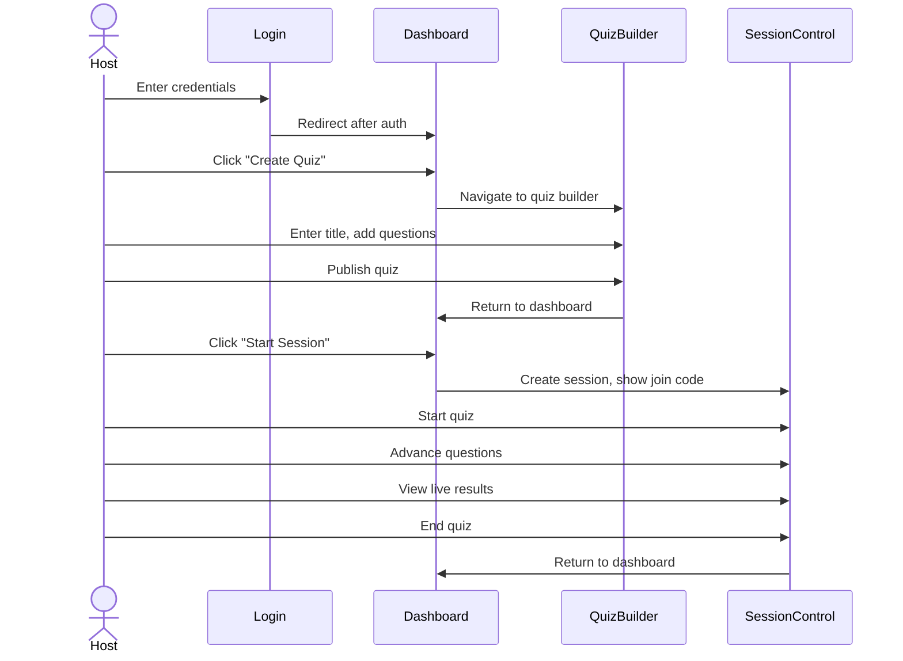
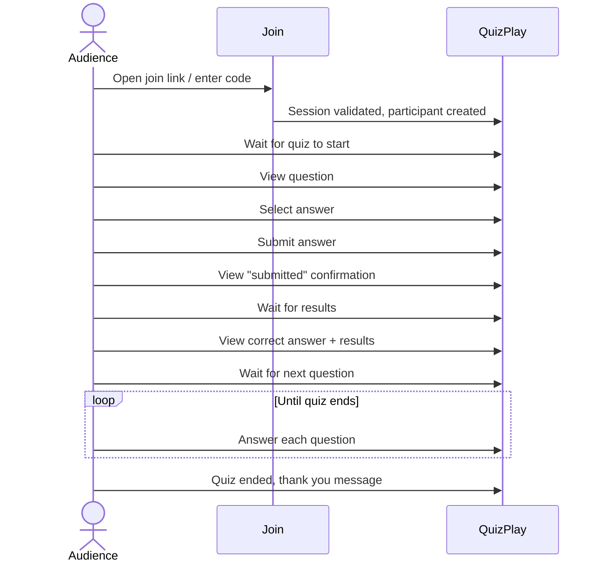
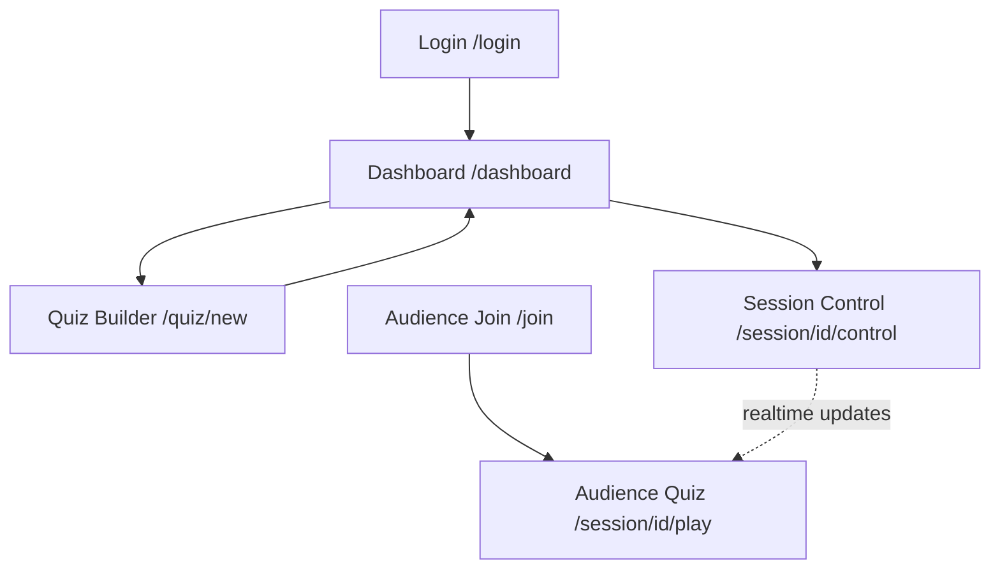

# User Flows (MVP)

This document describes the end-to-end user journeys for both Host and Audience personas.

---

## Host Flow: Create and Run Quiz

### Flow Diagram

### Step-by-Step Journey

#### Step 1: Login
1. Host navigates to `/login`
2. Enters email and password
3. Clicks "Login" button
4. System validates credentials and issues JWT token
5. Redirected to `/dashboard`

**Success Criteria**: JWT token stored, user redirected to dashboard

---

#### Step 2: Create Quiz
1. Host clicks "Create New Quiz" button on dashboard
2. Navigates to `/quiz/new`
3. Enters quiz title (required)
4. Optionally enters description
5. Clicks "Save Draft"

**Success Criteria**: Quiz created with status DRAFT

---

#### Step 3: Add Questions
1. Host clicks "Add Question" button
2. Enters question text
3. Enters 4 option texts
4. Selects correct answer (radio button)
5. Repeats for each question
6. Clicks "Save Draft" after each question

**Success Criteria**: Questions stored and associated with quiz

---

#### Step 4: Publish Quiz
1. Host reviews all questions
2. Clicks "Publish Quiz" button
3. System validates quiz (at least 1 question)
4. Quiz status changes to READY
5. Redirected to `/dashboard`

**Success Criteria**: Quiz status is READY, available for starting session

---

#### Step 5: Start Session
1. Host clicks "Start Session" button on quiz row
2. System creates quiz session and generates join code
3. Host navigates to `/session/{session_id}/control`
4. Join code displayed prominently
5. Participant count shows 0

**Success Criteria**: Session created with join code, waiting for participants

---

#### Step 6: Wait for Participants
1. Host shares join code with audience (verbally, QR code, link)
2. Participant count increases as audience joins
3. Host clicks "Start Quiz" when ready

**Success Criteria**: First question opened, broadcast to audience

---

#### Step 7: Run Quiz
1. Host views current question and live answer counts (bar chart)
2. Answer counts update in real-time (polling every 2s)
3. Host clicks "Close Question" when ready
4. Results displayed with correct answer highlighted
5. Host clicks "Next Question" to advance
6. Repeat until all questions complete

**Success Criteria**: All questions presented sequentially, results displayed after each

---

#### Step 8: End Quiz
1. Host clicks "End Quiz" button
2. Confirmation modal appears
3. Host confirms end action
4. Session status changes to ENDED
5. Final summary displayed (optional)
6. Host returns to dashboard

**Success Criteria**: Session ended, no more audience interactions allowed

---

## Audience Flow: Join and Participate

### Flow Diagram

### Step-by-Step Journey

#### Step 1: Receive Join Code
1. Host shares join code via:
   - Verbal announcement
   - Link (e.g., `https://swaya.me/join/ABC123`)
   - QR code displayed on screen
2. Audience receives code

---

#### Step 2: Join Session
1. Audience navigates to `/join` or `/join/{join_code}`
2. If code not in URL, enters code in input field
3. Clicks "Join" button
4. System validates join code
5. If valid, participant session created
6. Audience navigates to `/session/{session_id}/play`

**Success Criteria**: Participant ID assigned, session bound

**Error Cases**:
- Invalid code: "Quiz session not found"
- Session ended: "This quiz has already ended"

---

#### Step 3: Wait for Quiz to Start
1. Audience sees waiting screen: "Waiting for host to start quiz..."
2. Poll session status every 2 seconds
3. When host starts quiz, question displayed automatically

**Success Criteria**: Audience sees first question when host starts

---

#### Step 4: View Question
1. Question text displayed
2. 4 answer options shown as radio buttons
3. Submit button enabled

---

#### Step 5: Select and Submit Answer
1. Audience selects one option (radio button)
2. Clicks "Submit Answer" button
3. System validates submission (question open, no prior submission)
4. Answer recorded in database
5. Confirmation message displayed: "Answer submitted!"

**Success Criteria**: Answer recorded, UI shows confirmation

**Error Cases**:
- Question closed: "Question is no longer accepting answers"
- Duplicate submission: "You have already answered this question"

---

#### Step 6: Wait for Results
1. Audience sees "Waiting for results..." message
2. Poll session status every 2 seconds
3. When host closes question, results displayed automatically

**Success Criteria**: Audience sees correct answer and distribution

---

#### Step 7: View Results
1. Correct answer highlighted (green)
2. Bar chart shows answer distribution
3. Audience's selected answer indicated
4. Message: "Waiting for next question..."

---

#### Step 8: Repeat for Each Question
1. When host advances to next question, new question displayed
2. Repeat steps 4-7

---

#### Step 9: Quiz Ends
1. When host ends quiz, audience sees: "Quiz has ended. Thank you for participating!"
2. Session cleared, participant session expires

**Success Criteria**: Audience cannot submit more answers, session terminated

---

## Error Flows

### Host Loses Connection
1. Polling fails (network error)
2. UI shows reconnection message
3. Retry with exponential backoff
4. If reconnect successful, resume from last known state

### Audience Loses Connection
1. Polling fails (network error)
2. UI shows reconnection message
3. Retry with exponential backoff
4. If reconnect successful, check if question still open
5. If question closed, show results

### Session Expired
1. Polling returns 404 (session not found)
2. UI displays: "This session has ended or is no longer available"
3. Redirect to join page

---

## Happy Path Summary

### Host Happy Path (End-to-End)
1. Login → Dashboard → Create Quiz → Add Questions → Publish → Start Session → Start Quiz → Advance Questions → View Results → End Quiz → Dashboard

**Total Time**: ~10 minutes (for 5-question quiz)

### Audience Happy Path (End-to-End)
1. Receive Code → Join Session → Wait → View Question → Submit Answer → View Results → Repeat → Quiz Ends

**Total Time**: ~5-10 minutes (depends on host pacing)

---

## Alternative Flows

### Host Edits Quiz Before Starting Session
1. Dashboard → Select Quiz → Click "Edit" → Modify Questions → Save Draft → Return to Dashboard

### Host Abandons Session
1. Host closes browser during session
2. Session remains ACTIVE
3. Audience continues polling but sees no updates
4. **Post-MVP**: Auto-end session after 30 minutes of host inactivity

---

## Navigation Map

